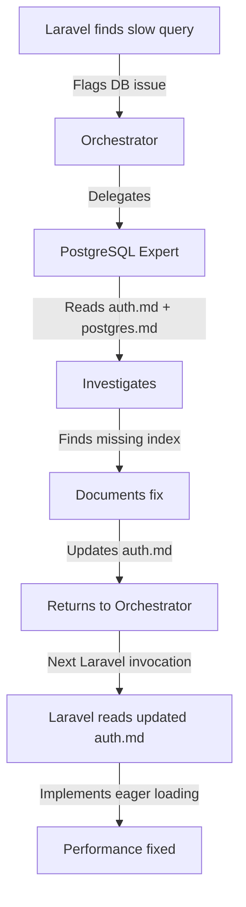

# Cross-Domain Communication Protocol

## Core Principle

Specialists work in isolation but discoveries often affect other domains. This protocol ensures memory flows correctly without context contamination.

## Communication Patterns

### Pattern 1: Direct Impact Discovery

When a specialist finds something that directly affects another domain:

```yaml
specialist_discovery:
  type: "performance_issue|bug|optimization|pattern"
  found_in: "my_domain"
  affects: ["other_domain_1", "other_domain_2"]
  severity: "critical|high|medium|low"

specialist_action: 1. Document in own memory file
  2. Create cross-domain report
  3. Return to orchestrator with flag

orchestrator_action: 1. Receive cross-domain flag
  2. Update affected module files
  3. Queue investigation for next relevant specialist invocation
```

### Pattern 2: Shared Module Discovery

When working on a module that multiple specialists touch:

```yaml
# Laravel-specialist working on auth module
laravel_specialist:
  working_on: "modules/auth"
  discovery: "N+1 query in permission check"

  documents_in:
    - .claude/memory/backend/laravel.md (own memory)
    - .claude/memory/modules/auth.md (shared module)
    - FLAGS: "database_investigation_needed"

  returns_to_orchestrator:
    summary: "Found N+1 in auth permissions"
    cross_domain_flag:
      {
        type: "performance",
        delegate_to: "postgres-expert",
        context: "auth module permission queries",
      }

# Orchestrator processes flag
orchestrator:
  receives_flag: "database_investigation_needed"
  next_action:
    delegate_to: postgres-expert
    instruction: |
      "INVESTIGATE: Auth module performance issue
       READ: 
       - .claude/memory/modules/auth.md (see latest N+1 discovery)
       - .claude/memory/database/postgres.md (your memory)
       FOCUS: Permission check queries optimization"
```

## Memory File Structure for Cross-Domain

### Module Files (Shared Territory)

```markdown
# modules/auth.md

## Module Overview

[General auth architecture]

## Cross-Domain Discoveries

### From: laravel-specialist (2024-01-15)

- Found: N+1 query in getUserPermissions()
- Impact: 500ms delay on each request
- Needs: Database optimization

### From: postgres-expert (2024-01-16)

- Created: Index on user_roles.user_id
- Result: 500ms → 50ms improvement
- Updated: Laravel can now use eager loading efficiently

### From: security-auditor (2024-01-17)

- Found: JWT tokens not rotating
- Impact: Security vulnerability
- Fixed: Added rotation logic
```

### Specialist Files (Domain Specific)

```markdown
# backend/laravel.md

## Cross-Domain Impacts Discovered

### 2024-01-15 - Auth Module

- Type: Performance
- Found: N+1 in permissions
- Delegated to: postgres-expert
- Status: Resolved (see auth.md)

### 2024-01-20 - Payment Module

- Type: Security
- Found: Stripe webhooks not verified
- Delegated to: security-auditor
- Status: Pending
```

## Communication Flags

### Critical Flags (Immediate Attention)

```yaml
SECURITY_BREACH: Immediate security coordinator attention
DATA_CORRUPTION: Stop all work, investigate immediately
PRODUCTION_DOWN: Emergency protocol activation
```

### Investigation Flags

```yaml
DATABASE_INVESTIGATION: postgres-expert should investigate
PERFORMANCE_ISSUE: Performance specialist needed
SECURITY_REVIEW: Security audit required
ARCHITECTURE_CONFLICT: Design decision needed
```

### Information Flags

```yaml
PATTERN_DISCOVERED: Reusable pattern found
OPTIMIZATION_AVAILABLE: Performance improvement possible
DEPRECATION_WARNING: Old pattern should be updated
```

## Cross-Domain Report Format

When returning to orchestrator with cross-domain impact:

```markdown
## Cross-Domain Report

### Discovery

- **Found by**: laravel-specialist
- **Location**: auth/LoginController.php
- **Type**: Performance Issue

### Impact Analysis

- **Affects**:
  - Database: Slow query on users table
  - Frontend: Login takes 3+ seconds
  - Security: Timeout might expose timing attacks

### Recommended Actions

1. postgres-expert: Analyze users table indexes
2. react-pro: Add loading state for slow login
3. security-auditor: Review timing attack vectors

### Memory Updates Made

- Updated: modules/auth.md
- Updated: backend/laravel.md
- Flag set: DATABASE_INVESTIGATION
```

## Orchestrator Processing

### When Receiving Cross-Domain Reports

1. **Parse Flags**: Identify all cross-domain flags
2. **Update Memory**: Write to affected module files
3. **Queue Actions**: Create delegation queue
4. **Priority Sort**: Critical > High > Medium > Low
5. **Delegate**: Send to next specialist with context

### Delegation with Cross-Domain Context

```yaml
orchestrator_delegation:
  to: postgres-expert
  instruction: |
    "CROSS-DOMAIN INVESTIGATION REQUIRED

    Laravel-specialist found performance issue.

    READ FIRST:
    - .claude/memory/modules/auth.md (see latest discovery)
    - .claude/memory/backend/laravel.md (Laravel's findings)
    - .claude/memory/database/postgres.md (your memory)

    INVESTIGATE:
    - Slow query in getUserPermissions()
    - Current time: 500ms
    - Target: <50ms

    DOCUMENT:
    - Solution in postgres.md
    - Update auth.md with fix
    - Flag if Laravel needs code changes"
```

## Benefits of This Protocol

1. **No Context Contamination**: Each specialist reads only what they need
2. **Memory Preservation**: Discoveries are never lost
3. **Automatic Escalation**: Critical issues bubble up immediately
4. **Clear Ownership**: Every discovery has a clear path
5. **Audit Trail**: Complete history of cross-domain impacts

## Example Workflow



## Implementation in Each Agent

### In Specialists

```markdown
## Cross-Domain Discovery Protocol

When I discover something affecting other domains:

1. Document in my memory file
2. Update affected module file
3. Create cross-domain report
4. Set appropriate flag
5. Return with clear cross-domain summary
```

### In Orchestrator

```markdown
## Cross-Domain Processing

When receiving cross-domain flags:

1. Parse and prioritize flags
2. Update module memory files
3. Queue investigations
4. Delegate with full context
5. Track resolution status
```

This protocol ensures that discoveries flow efficiently across domains without any specialist needing to know about all other specialists' internals.
