# 📡 Memory Communication Protocol v2.0

## Executive Summary

Cada invocación de un agente es una ventana de contexto NUEVA. El sistema de memoria persistente permite que los agentes "recuerden" entre invocaciones mediante hooks automáticos.

## 🔄 Lifecycle de una Invocación con Memoria

```mermaid
graph TD
    A[Usuario solicita tarea] --> B[Claude invoca agente]
    B --> C[SubagentStart Hook]
    C --> D[Carga memoria previa del agente]
    D --> E[Agente ejecuta con contexto histórico]
    E --> F[Agente completa tarea]
    F --> G[SubagentStop Hook]
    G --> H[Guarda nuevo conocimiento]
    H --> I[Ventana de contexto se cierra]
    I --> J[Memoria persiste en disco]
```



## 📊 Estructura de Datos de Memoria

### 1. Knowledge Base (knowledge.json)
```json
{
  "module_info": {
    "path": "/src/dream",
    "type": "processor",
    "framework": "Laravel",
    "version": "2.3.0"
  },
  "key_files": [
    "src/dream/processors/DataProcessor.php",
    "src/dream/services/DreamService.php"
  ],
  "conventions": [
    "Always use Repository pattern",
    "Tests required with >80% coverage",
    "No direct DB queries in controllers"
  ],
  "decisions": [
    {
      "date": "2024-12-09",
      "decision": "Use Redis for caching dream data",
      "rationale": "Better performance for real-time processing"
    }
  ],
  "last_updated": "2024-12-09T10:30:00Z"
}
```

### 2. History Log (history.json)
```json
[
  {
    "timestamp": "2024-12-09T10:30:00Z",
    "action": "function_implementation",
    "details": {
      "function": "processSpecificData",
      "location": "DataProcessor.php:145-189",
      "complexity": 6
    },
    "files": [
      "src/dream/processors/DataProcessor.php",
      "tests/Feature/Dream/DataProcessorTest.php"
    ],
    "success": true
  }
]
```

### 3. Pattern Recognition (patterns.json)
```json
{
  "Repository Pattern": 15,
  "Service Pattern": 12,
  "Factory Pattern": 3,
  "Observer Pattern": 2,
  "Singleton Pattern": 1
}
```

## 🎯 Protocolo de Comunicación

### Mensaje de Contexto Inicial (Agente Dinámico → Engineer)

```json
{
  "from": "dream-agent",
  "to": "engineer-laravel",
  "type": "implementation_context",
  "timestamp": "2024-12-09T10:30:00Z",
  "memory_loaded": true,
  "context": {
    "task": "Implement processSpecificData function",
    "location": {
      "file": "src/dream/processors/DataProcessor.php",
      "line": 145,
      "method": "after processRawData()"
    },
    "requirements": {
      "pattern": "Repository",
      "inheritance": "BaseProcessor",
      "dependencies": ["DreamService", "CacheManager"],
      "validation": "required"
    },
    "existing_context": {
      "similar_functions": ["processRawData", "processBatchData"],
      "current_patterns": ["Repository", "Service"],
      "test_location": "tests/Feature/Dream/"
    },
    "warnings": [
      "Do not duplicate processRawData() logic",
      "Must handle null values",
      "Requires transaction wrapper"
    ],
    "memory_insights": {
      "previous_issues": "Race conditions in parallel processing",
      "learned_solutions": "Use Redis locks for concurrency",
      "performance_baseline": "< 100ms for 1000 records"
    }
  }
}
```

### Mensaje de Revisión (Engineer → Agente Dinámico)

```json
{
  "from": "engineer-laravel",
  "to": "dream-agent",
  "type": "implementation_complete",
  "timestamp": "2024-12-09T11:00:00Z",
  "changes": {
    "created": [
      {
        "file": "src/dream/processors/DataProcessor.php",
        "lines_added": 44,
        "methods": ["processSpecificData", "validateSpecificData"]
      }
    ],
    "modified": [
      {
        "file": "tests/Feature/Dream/DataProcessorTest.php",
        "lines_added": 35,
        "test_cases": 5
      }
    ],
    "metrics": {
      "complexity": 6,
      "test_coverage": 92,
      "performance": "87ms avg"
    }
  },
  "request_review": true
}
```

### Mensaje de Validación con Flags (Agente Dinámico → Orchestrator)

```json
{
  "from": "dream-agent",
  "to": "orchestrator",
  "type": "review_complete",
  "timestamp": "2024-12-09T11:15:00Z",
  "validation": {
    "status": "approved_with_flags",
    "compliance": {
      "patterns": true,
      "conventions": true,
      "tests": true,
      "performance": true
    },
    "issues": [],
    "suggestions": [
      "Consider adding batch processing for large datasets"
    ]
  },
  "memory_updates": {
    "new_patterns": [],
    "new_files": ["DataProcessor.php"],
    "new_knowledge": "Specific data processing requires Redis locks"
  },
  "flags": [
    {
      "target": "database-coordinator",
      "priority": "medium",
      "message": "New index needed on dream_data.processor_id for optimal performance",
      "context": "processSpecificData() performs frequent lookups"
    },
    {
      "target": "devops-coordinator",
      "priority": "low",
      "message": "Redis memory usage will increase ~10MB",
      "context": "New caching layer for specific data processing"
    }
  ]
}
```

## 🔧 Hooks Implementation Details

### SubagentStart Hook
```python
# Triggered automatically when agent is invoked
# Loads all historical knowledge into the fresh context window

def on_subagent_start(agent_name):
    memory = load_agent_memory(agent_name)
    inject_into_context(memory)
    return f"Loaded {len(memory)} bytes of historical knowledge"
```

### SubagentStop Hook
```python
# Triggered automatically when agent completes
# Extracts and saves new knowledge before context window closes

def on_subagent_stop(agent_name, output):
    knowledge = extract_knowledge(output)
    patterns = detect_patterns(output)
    decisions = extract_decisions(output)
    flags = extract_flags(output)
    
    save_to_memory({
        'knowledge': knowledge,
        'patterns': patterns,
        'decisions': decisions,
        'flags': flags
    })
    
    return f"Saved {len(knowledge)} new insights"
```

## 📈 Memory Evolution Example

### Session 1 (Fresh Agent)
```
dream-agent memory: EMPTY
Task: "Create data processor"
Learning: "Module uses Repository pattern"
Saved: Pattern detected, file structure mapped
```

### Session 2 (With Memory)
```
dream-agent memory: Knows Repository pattern
Task: "Add batch processing"
Context: "I see you use Repository pattern, I'll maintain consistency"
Learning: "Batch processing needs transactions"
Saved: Transaction requirement added to conventions
```

### Session 3 (Evolved Knowledge)
```
dream-agent memory: Repository + Transactions
Task: "Optimize performance"
Context: "Based on previous patterns and transaction requirements..."
Learning: "Redis caching improves performance 10x"
Saved: Performance optimization pattern
```

## 🚨 Critical Success Factors

1. **Python must be installed** - Memory system requires Python 3.x
2. **Hooks must be active** - Check .claude/hooks.json is loaded
3. **Paths must exist** - .claude/memory/ structure must be created
4. **Agents must output structured data** - For proper parsing

## 🔍 Debugging Memory Issues

### Check if memory is loading:
```bash
python .claude/scripts/memory_manager.py load dream-agent
```

### Check if memory is saving:
```bash
echo "test output" | python .claude/scripts/memory_manager.py save dream-agent
```

### View current memory:
```bash
cat .claude/memory/agents/dream_agent/knowledge.json | jq '.'
```

### View memory history:
```bash
cat .claude/memory/agents/dream_agent/history.json | jq '.[-5:]'
```

## 📊 Performance Metrics

- **Memory Load Time**: < 100ms per agent
- **Memory Save Time**: < 200ms per agent
- **Memory Size Limit**: 1MB per agent (auto-consolidates)
- **History Retention**: Last 100 interactions
- **Pattern Detection**: Real-time during save

## 🔄 Auto-Consolidation

Weekly consolidation removes duplicates and optimizes storage:

```python
# Runs automatically or manually
python .claude/scripts/memory_manager.py consolidate dream-agent
```

## 🎯 Best Practices

1. **Always invoke agents with clear tasks** - Better knowledge extraction
2. **Use structured outputs** - Improves memory parsing
3. **Review flags regularly** - Cross-domain communication
4. **Monitor memory growth** - Consolidate when needed
5. **Trust the memory** - Agents genuinely "remember"

---

**Remember**: Without this protocol, every agent invocation starts from zero. With it, agents build cumulative expertise that improves with every interaction.