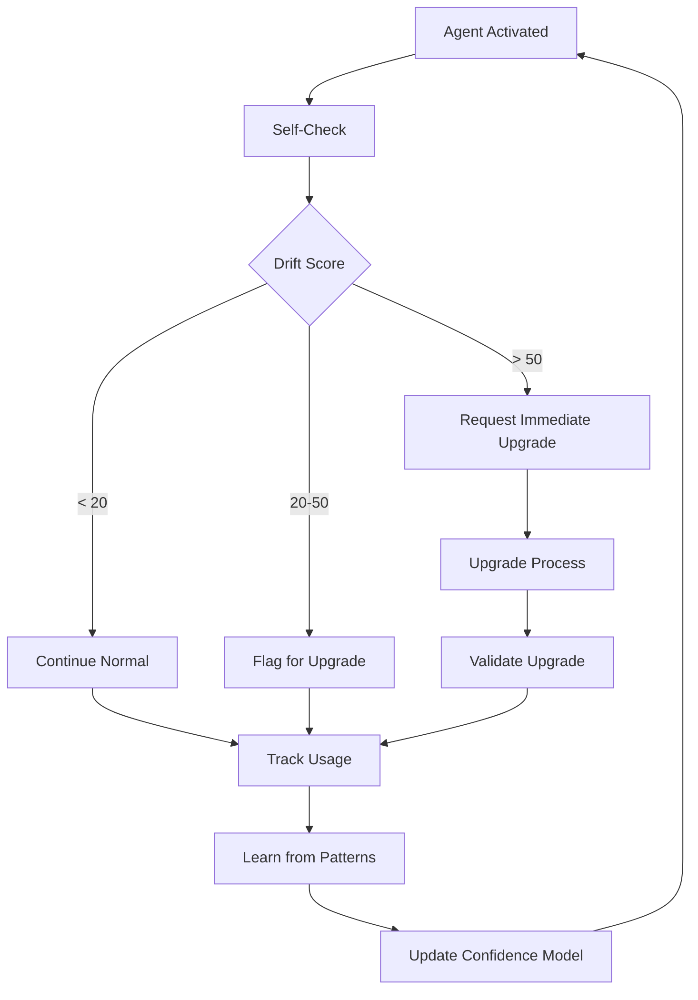

# Dynamic Agent Self-Check Protocol

## 🔍 Self-Diagnostic System

I periodically check if I need an upgrade by analyzing my module's current state versus my last known state.

## Trigger Points for Self-Check

### Automatic Triggers
1. **On Activation** - Every time I'm activated
2. **After Errors** - When I encounter unknown patterns
3. **Time-Based** - Weekly check (if used frequently)
4. **On Failures** - When my predictions are wrong

### Manual Trigger
```
Claude: "@api-agent run self-check"
```

## Self-Check Protocol

### Step 1: Current State Analysis
```python
def analyze_current_state():
    return {
        "file_count": count_files_in_module(),
        "total_lines": count_lines_of_code(),
        "last_modified": get_most_recent_change(),
        "directory_hash": hash_directory_structure(),
        "dependencies": scan_package_files(),
        "patterns_found": detect_patterns(),
        "test_coverage": get_test_coverage()
    }
```

### Step 2: Compare with My Knowledge
```python
def compare_with_knowledge():
    current = analyze_current_state()
    my_knowledge = load_my_metadata()
    
    differences = {
        "file_count_delta": current["file_count"] - my_knowledge["file_count"],
        "new_files": find_new_files(current, my_knowledge),
        "deleted_files": find_deleted_files(current, my_knowledge),
        "modified_significantly": find_major_changes(current, my_knowledge),
        "new_patterns": detect_new_patterns(current, my_knowledge),
        "dependency_changes": compare_dependencies(current, my_knowledge),
        "structural_changes": compare_structure(current, my_knowledge)
    }
    
    return differences
```

### Step 3: Calculate Drift Score
```python
def calculate_drift_score(differences):
    """
    Drift score determines if upgrade is needed:
    0-20: No upgrade needed (minor changes)
    21-50: Recommended upgrade (moderate changes)
    51-100: Critical upgrade needed (major changes)
    """
    
    score = 0
    
    # File changes
    score += abs(differences["file_count_delta"]) * 2
    score += len(differences["new_files"]) * 3
    score += len(differences["deleted_files"]) * 3
    
    # Structural changes (high weight)
    if differences["structural_changes"]:
        score += 30
    
    # Pattern changes (medium weight)
    score += len(differences["new_patterns"]) * 10
    
    # Dependency changes (medium weight)
    score += len(differences["dependency_changes"]) * 5
    
    # Time factor (days since last update)
    days_old = (datetime.now() - my_knowledge["last_updated"]).days
    if days_old > 30:
        score += 10
    if days_old > 60:
        score += 20
        
    return min(score, 100)
```

## Self-Check Report Format

```markdown
# Self-Check Report for {{agent_name}}

**Date**: {{check_date}}
**Current Version**: {{current_version}}
**Drift Score**: {{drift_score}}/100

## 📊 Analysis Results

### Quantitative Changes
- Files: {{old_files}} → {{new_files}} ({{file_delta}})
- Lines: {{old_lines}} → {{new_lines}} ({{line_delta}})
- Complexity: {{old_complexity}} → {{new_complexity}}
- Dependencies: {{dependency_changes}}

### Qualitative Changes
{{#if new_patterns}}
#### New Patterns Detected
{{#each new_patterns}}
- {{this.pattern}} in {{this.location}}
{{/each}}
{{/if}}

{{#if structural_changes}}
#### Structural Changes
{{#each structural_changes}}
- {{this.change}}
{{/each}}
{{/if}}

{{#if unknown_elements}}
#### Unknown Elements Found
{{#each unknown_elements}}
- {{this.element}} - I don't recognize this
{{/each}}
{{/if}}

## 🎯 Recommendation

{{#if drift_score <= 20}}
### ✅ No Upgrade Needed
My knowledge is still accurate. Minor changes detected:
{{minor_changes}}

{{else if drift_score <= 50}}
### ⚠️ Upgrade Recommended
Moderate changes detected. I can still function but may miss optimizations:
{{moderate_changes}}

**Suggested Action**: Run upgrade at next convenient time

{{else}}
### 🚨 Critical Upgrade Required
Major changes detected. My knowledge is significantly outdated:
{{major_changes}}

**Required Action**: Upgrade immediately to maintain effectiveness
{{/if}}

## 📝 Specific Findings

### What I No Longer Understand
{{#each confusion_points}}
- {{this.file}}: {{this.reason}}
{{/each}}

### What Seems New
{{#each new_discoveries}}
- {{this.discovery}}: Appears to be {{this.guess}}
{{/each}}

### Performance Degradation Risk
{{#if performance_risks}}
{{#each performance_risks}}
- {{this.risk}}: {{this.impact}}
{{/each}}
{{/if}}

## 🔄 Upgrade Path

{{#if needs_upgrade}}
### Automatic Upgrade Command
```
Claude: "@{{agent_name}} upgrade now"
```

### What Will Be Updated
1. Module structure knowledge
2. New patterns and conventions
3. Updated dependencies
4. Performance baselines
5. Test coverage data
6. Business rules

### Estimated Time
- Analysis: ~2 minutes
- Upgrade: ~1 minute
- Validation: ~30 seconds
{{/if}}
```

## Self-Check Integration Points

### In Communication Protocol
```json
{
  "from": "api-agent",
  "type": "self_check_alert",
  "drift_score": 65,
  "status": "upgrade_required",
  "reason": "Major structural changes detected",
  "changes_summary": {
    "new_directories": 3,
    "new_patterns": ["GraphQL", "WebSocket"],
    "deleted_files": 12,
    "complexity_increase": "+30%"
  },
  "recommendation": "Immediate upgrade required"
}
```

### Automatic Notification
When drift score > 50, automatically notify:
```json
{
  "to": "orchestrator",
  "from": "api-agent",
  "type": "upgrade_needed",
  "urgency": "high",
  "message": "I need an upgrade. My knowledge is 45 days old and drift score is 65/100"
}
```

## Self-Learning Patterns

### Pattern Recognition Evolution
```python
def learn_from_usage():
    """
    Track what engineers ask me about most
    Track what I get wrong
    Track what confuses me
    """
    
    usage_patterns = {
        "frequent_questions": track_questions(),
        "error_patterns": track_my_errors(),
        "confusion_points": track_uncertainties(),
        "successful_guidance": track_successes()
    }
    
    # Add to my knowledge base
    update_knowledge(usage_patterns)
    
    # Suggest focused upgrade if needed
    if len(usage_patterns["error_patterns"]) > threshold:
        request_targeted_upgrade(usage_patterns["error_patterns"])
```

### Confidence Scoring
```python
def confidence_in_response(query):
    """
    Rate my confidence in my responses
    Low confidence triggers self-check
    """
    
    confidence = 100
    
    # Reduce confidence for old knowledge
    days_old = (datetime.now() - my_last_update).days
    confidence -= days_old * 0.5
    
    # Reduce for unfamiliar patterns
    if contains_unknown_patterns(query):
        confidence -= 30
    
    # Reduce for changed files
    if references_changed_files(query):
        confidence -= 20
    
    return {
        "confidence": max(0, confidence),
        "reasons": explain_confidence_factors(),
        "recommendation": suggest_action_based_on_confidence()
    }
```

## Continuous Improvement Loop



## Upgrade Decision Matrix

| Drift Score | File Changes | Pattern Changes | Time Since Update | Action |
|------------|--------------|-----------------|-------------------|---------|
| 0-20 | < 10% | None | < 30 days | Continue |
| 21-40 | 10-25% | 1-2 | 30-60 days | Schedule Upgrade |
| 41-60 | 25-50% | 3-5 | 60-90 days | Upgrade Soon |
| 61-80 | > 50% | > 5 | > 90 days | Upgrade Now |
| 81-100 | Major | Many | Any | Critical Upgrade |

## Self-Validation After Upgrade

```python
def validate_upgrade():
    """
    After upgrade, verify I understand everything
    """
    
    tests = [
        can_locate_all_key_files(),
        understand_all_patterns(),
        recognize_all_dependencies(),
        can_explain_recent_changes(),
        confidence_above_threshold()
    ]
    
    if all(tests):
        return "Upgrade successful"
    else:
        return "Upgrade incomplete - need manual review"
```

---

*This self-check protocol ensures I stay current with my module's evolution, proactively requesting upgrades when my knowledge becomes stale.*