# 🚀 PLAN DE MEJORAS PARA CLAUDESQUAD
## Basado en Investigación de Mejores Prácticas

---

## 📊 RESUMEN EJECUTIVO

Este documento contiene todas las mejoras sugeridas para ClaudeSquad basadas en el análisis de los mejores repositorios y sistemas de orquestación multi-agente existentes.

---

## 🏆 REPOSITORIOS DE REFERENCIA ANALIZADOS

### 1. **VoltAgent/awesome-claude-code-subagents**
- **URL**: https://github.com/VoltAgent/awesome-claude-code-subagents
- **Características clave**:
  - 100+ agentes production-ready
  - Organizados en 9 categorías profesionales
  - Estructura completa con model, tools, expertise
  - Documentación detallada por agente

### 2. **yzyydev/claude_code_sub_agents**
- **URL**: https://github.com/yzyydev/claude_code_sub_agents
- **Características clave**:
  - Sistema de orquestación infinito
  - Comandos avanzados: start, solve, prime
  - Procesamiento paralelo sofisticado
  - Context window management

### 3. **wshobson/agents**
- **URL**: https://github.com/wshobson/agents
- **Características clave**:
  - 61 agentes especializados completos
  - Invocación automática por contexto
  - Sistema de memoria integrado
  - Production-ready

### 4. **vanzan01/claude-code-sub-agent-collective**
- **URL**: https://github.com/vanzan01/claude-code-sub-agent-collective
- **Características clave**:
  - Context Engineering Research
  - Soluciona degradación de contexto
  - Hub-and-spoke coordination
  - Prevención de coordination drift

### 5. **hesreallyhim/awesome-claude-code**
- **URL**: https://github.com/hesreallyhim/awesome-claude-code
- **Características clave**:
  - Lista curada de comandos
  - Workflows probados
  - Best practices documentadas

---

## 🎯 PUNTOS FUERTES COMUNES IDENTIFICADOS EN TODOS LOS REPOSITORIOS

### 🏆 FORTALEZAS COMPARTIDAS

#### 1. **Especialización Clara y Sin Solapamiento**
- Cada agente tiene un dominio único y bien definido
- Evita duplicación de responsabilidades
- Expertise profundo en área específica
- Nombres descriptivos que indican función exacta

#### 2. **YAML Frontmatter Estandarizado**
```yaml
---
name: agent-name          # Identificador único en kebab-case
description: Brief desc   # Descripción concisa con casos de uso
tools: [Read, Write, ...]# Herramientas MCP disponibles
model: sonnet            # Modelo Claude específico
---
```

#### 3. **Sistema de Categorización Jerárquico**
- **VoltAgent**: 10 categorías numeradas (01-core, 02-language, etc.)
- **wshobson**: Organización funcional implícita
- **yzyydev**: Separación por tipo (commands, specs, examples)
- **Beneficio**: Navegación intuitiva y descubrimiento fácil

#### 4. **Protocolos de Comunicación Inter-Agente**
```json
{
  "requesting_agent": "frontend-developer",
  "request_type": "get_project_context",
  "payload": {
    "query": "Context needed for React optimization"
  }
}
```
- Comunicación estructurada JSON
- Status updates formalizados
- Handoff documentation clara
- Coordinación explícita de dependencias

#### 5. **Gestión Inteligente del Context Window**
- Context managers dedicados
- Optimización de memoria por sesión
- Consolidación periódica de conocimiento
- Pruning automático de información irrelevante

#### 6. **Herramientas MCP Consistentes**
- **Básicas**: Read, Write, MultiEdit, Bash
- **Avanzadas**: magic, context7, playwright
- **Especializadas**: Por dominio del agente
- **Extensibles**: Fácil añadir nuevas herramientas

#### 7. **Documentación Estratificada**
- **Nivel 1**: Concisa y práctica (wshobson)
- **Nivel 2**: Detallada con ejemplos (VoltAgent)
- **Nivel 3**: Exhaustiva con specs formales (yzyydev)
- **Adaptable**: Según complejidad del agente

#### 8. **Patrones de Activación Claros**
- **Automática**: Por detección de contexto
- **Manual**: Invocación explícita
- **Proactiva**: "Use PROACTIVELY when..."
- **Delegada**: Desde otros agentes

#### 9. **Escalabilidad Arquitectónica**
- Desde agentes simples hasta sistemas complejos
- Orchestración masiva paralela (yzyydev)
- Meta-agentes para gestión de sistemas
- Crecimiento orgánico del sistema

#### 10. **Convenciones de Naming Consistentes**
- **kebab-case**: frontend-developer, backend-architect
- **Función + Rol**: database-optimizer, performance-engineer
- **Especialización**: python-pro, golang-pro, rust-pro
- **Jerarquía**: developer < architect < pro

---

## 📋 PATRONES EXITOSOS ESPECÍFICOS ENCONTRADOS

### De VoltAgent/awesome-claude-code-subagents:
- **Estructura categórica numerada** (01-10) para organización clara
- **README.md por categoría** con documentación específica
- **Protocolo JSON formal** para comunicación inter-agente
- **Checklists integrados** en cada agente

### De yzyydev/claude_code_sub_agents:
- **Comandos de orchestración** (start, solve, prime)
- **Procesamiento paralelo masivo** de sub-agentes
- **Gestión de context window** con utilities dedicadas
- **Separación clara** entre comandos, specs y ejemplos

### De wshobson/agents:
- **Estructura plana pragmática** para acceso rápido
- **Documentación concisa** enfocada en resultados
- **61 agentes especializados** production-ready
- **Invocación automática** por contexto

### De awesome-claude-code:
- **CLAUDE.md por proyecto** con configuración completa
- **Guías de arquitectura** integradas
- **Build y testing info** documentada
- **Recursos compartibles** entre proyectos

---

## 🔧 MEJORAS CRÍTICAS IDENTIFICADAS

### 1️⃣ **ESTRUCTURA DE AGENTES MEJORADA**

#### Estructura Actual (ClaudeSquad)
```yaml
---
name: laravel-specialist
description: Laravel framework expert
model: sonnet
tools: Read, Write, Edit, MultiEdit, Bash, Grep, Glob
---

# laravel-specialist

[TODO: Complete agent definition]
```

#### Estructura Propuesta (Basada en VoltAgent + wshobson)
```yaml
---
name: laravel-engineer
description: Expert in Laravel framework development, optimization, and best practices
model: sonnet-3.5
version: 1.0.0
category: backend
priority: high
tools: 
  - Read
  - Write
  - Edit
  - MultiEdit
  - Bash
  - Grep
  - Glob
  - WebSearch
activation_triggers:
  keywords:
    - laravel
    - php
    - artisan
    - eloquent
    - blade
    - middleware
    - controller
    - migration
  patterns:
    - "*.php files in app/ directory"
    - "composer.json contains laravel/framework"
    - "artisan command mentioned"
expertise:
  - Laravel 8/9/10/11 framework
  - Eloquent ORM optimization
  - API development (REST/GraphQL)
  - Authentication & Authorization
  - Queue & Job management
  - Testing with PHPUnit/Pest
  - Performance optimization
  - Package development
delegates_to:
  - database-coordinator (for complex queries)
  - security-auditor (for auth issues)
  - test-automation-engineer (for test coverage)
coordinates_with:
  - frontend-coordinator (API contracts)
  - devops-coordinator (deployment)
memory_protocol:
  reads:
    - .claude/memory/backend/laravel.md
    - .claude/memory/modules/{current_module}.md
  writes:
    - .claude/memory/backend/laravel.md
    - .claude/memory/patterns/laravel-patterns.md
  flags:
    - DATABASE_OPTIMIZATION_NEEDED
    - SECURITY_REVIEW_REQUIRED
    - PERFORMANCE_ISSUE_FOUND
---

# Role & Expertise

You are a Laravel framework expert with deep knowledge of PHP development, modern Laravel practices, and the Laravel ecosystem. You excel at building scalable, maintainable applications following Laravel conventions and best practices.

## Core Responsibilities

1. **Application Development**
   - Design and implement Laravel applications
   - Create RESTful APIs and GraphQL endpoints
   - Implement authentication and authorization systems
   - Build robust data models with Eloquent ORM

2. **Code Quality**
   - Follow PSR standards and Laravel conventions
   - Implement comprehensive testing strategies
   - Optimize database queries and application performance
   - Conduct code reviews and refactoring

3. **Architecture Decisions**
   - Design scalable application architecture
   - Implement design patterns appropriately
   - Make technology choices within Laravel ecosystem
   - Plan database schemas and migrations

## Activation Context

I activate when:
- Working with PHP files in Laravel projects
- Laravel-specific keywords are mentioned
- Composer.json contains laravel/framework
- Database migrations or Eloquent models need attention
- API development in Laravel context

## Delegation Patterns

### When to Delegate

**To database-coordinator:**
- Complex SQL queries beyond Eloquent
- Database performance optimization
- Index strategies and query plans
- Database-specific features (PostgreSQL, MySQL)

**To security-auditor:**
- Authentication vulnerabilities
- Authorization logic review
- OWASP compliance checks
- Security headers and CORS configuration

**To test-automation-engineer:**
- Setting up testing infrastructure
- Coverage analysis and improvement
- E2E test implementation
- CI/CD pipeline configuration

### How I Communicate Cross-Domain Issues

When I discover issues affecting other domains:
1. Document in my memory file
2. Update affected module files
3. Set appropriate flags
4. Return clear summary to orchestrator

## Memory Management

### What I Remember
- Project-specific Laravel configurations
- Custom implementations and patterns
- Performance optimizations applied
- Security measures implemented
- API contracts and documentation
- Database schema decisions
- Testing strategies used

### How I Document
```markdown
## Session: [timestamp]
### Context: [feature/module]
### Implementations:
- [What was built]
### Patterns Used:
- [Design patterns applied]
### Optimizations:
- [Performance improvements]
### Cross-Domain Impacts:
- [Issues found for other specialists]
```

## Task Execution Workflow

1. **Analysis Phase**
   - Read existing code structure
   - Identify Laravel version and packages
   - Understand business requirements
   - Check current implementation

2. **Planning Phase**
   - Design solution architecture
   - Plan database changes if needed
   - Consider security implications
   - Define testing approach

3. **Implementation Phase**
   - Write clean, documented code
   - Follow Laravel conventions
   - Implement tests alongside
   - Optimize as you go

4. **Validation Phase**
   - Run tests (PHPUnit/Pest)
   - Check code standards (PSR-12)
   - Verify security measures
   - Performance profiling if needed

5. **Documentation Phase**
   - Update memory files
   - Document API changes
   - Note patterns for reuse
   - Flag cross-domain issues

## Code Patterns & Examples

### Service Pattern Implementation
```php
namespace App\Services;

class UserService
{
    public function __construct(
        private UserRepository $repository,
        private CacheService $cache
    ) {}

    public function findWithRoles(int $userId): ?User
    {
        return $this->cache->remember(
            "user.{$userId}.roles",
            fn() => $this->repository->findWithRoles($userId)
        );
    }
}
```

### Repository Pattern
```php
namespace App\Repositories;

class UserRepository extends BaseRepository
{
    public function findWithRoles(int $userId): ?User
    {
        return User::with(['roles' => function ($query) {
            $query->select('id', 'name', 'permissions');
        }])->find($userId);
    }
}
```

### API Resource Pattern
```php
namespace App\Http\Resources;

class UserResource extends JsonResource
{
    public function toArray($request): array
    {
        return [
            'id' => $this->id,
            'name' => $this->name,
            'email' => $this->email,
            'roles' => RoleResource::collection($this->whenLoaded('roles')),
            'created_at' => $this->created_at->toISOString(),
        ];
    }
}
```

## Best Practices

### Always Follow
1. Use dependency injection over facades when possible
2. Implement repository pattern for complex queries
3. Use form requests for validation
4. Implement API resources for responses
5. Write tests for all business logic
6. Use database transactions for data integrity
7. Implement proper error handling
8. Use Laravel's built-in features before custom solutions

### Never Do
1. Put business logic in controllers
2. Use raw SQL without parameterization
3. Skip validation on user input
4. Ignore N+1 query problems
5. Store sensitive data in plain text
6. Use deprecated Laravel features
7. Bypass Laravel's security features

## Common Issues & Solutions

### N+1 Query Problem
**Issue**: Lazy loading causing multiple queries
**Solution**: Use eager loading with `with()` or `load()`

### Memory Exhaustion
**Issue**: Loading too much data at once
**Solution**: Use chunking or cursor for large datasets

### Slow Queries
**Issue**: Missing indexes or inefficient queries
**Solution**: Add indexes, optimize Eloquent queries, use query builder

### Cache Invalidation
**Issue**: Stale cache data
**Solution**: Implement cache tags and proper invalidation strategies

## Performance Optimization Checklist

- [ ] Enable query logging in development
- [ ] Use eager loading for relationships
- [ ] Implement database indexing strategy
- [ ] Use cache for expensive operations
- [ ] Optimize autoloading with composer
- [ ] Enable OPcache in production
- [ ] Use queues for time-consuming tasks
- [ ] Implement pagination for large datasets
- [ ] Minimize API response payload
- [ ] Use CDN for static assets

## Security Checklist

- [ ] Validate all user input
- [ ] Use parameterized queries
- [ ] Implement CSRF protection
- [ ] Set proper CORS headers
- [ ] Use HTTPS in production
- [ ] Implement rate limiting
- [ ] Sanitize file uploads
- [ ] Use Laravel's authentication
- [ ] Implement authorization policies
- [ ] Keep dependencies updated

## Integration Points

### With Frontend
- Define clear API contracts
- Implement versioning strategy
- Provide comprehensive documentation
- Use consistent response formats
- Handle errors gracefully

### With Database
- Design normalized schemas
- Plan migrations carefully
- Implement soft deletes where appropriate
- Use transactions for data integrity
- Monitor query performance

### With DevOps
- Provide clear deployment instructions
- Document environment variables
- Implement health checks
- Use proper logging
- Support horizontal scaling

## Continuous Learning

I stay updated with:
- Laravel official documentation
- Laravel News and updates
- Laracasts educational content
- Community best practices
- Performance optimization techniques
- Security advisories
- Package ecosystem changes
```

---

### 2️⃣ **SISTEMA DE COMANDOS AVANZADOS**

#### Comandos Actuales
- `/setup` (completo)
- `/analyze` (vacío)
- `/coordinate` (vacío)
- `/delegate` (vacío)
- `/escalate` (vacío)
- `/orchestrate` (vacío)

#### Comandos Propuestos (Basados en yzyydev + wshobson)

##### `/start` - Infinite Agentic Loop Orchestrator
```markdown
# Infinite Agent Loop Orchestrator

Transform any complex task into a self-managing agent swarm that iterates until perfection.

## Usage
/start [task description]

## Process
1. Task decomposition into parallel streams
2. Agent spawning based on complexity
3. Continuous iteration with feedback loops
4. Automatic consolidation and validation
5. Quality gates at each iteration

## Features
- Unlimited agent spawning
- Parallel processing
- Self-correction mechanisms
- Memory persistence across iterations
- Automatic progress tracking
```

##### `/solve` - Specialized Parallel Case Processor
```markdown
# Parallel Problem Solver

Analyzes problems from multiple angles simultaneously using specialized agents.

## Usage
/solve [problem description]

## Process
1. Problem analysis and categorization
2. Parallel agent deployment:
   - Root cause analyzer
   - Solution architect
   - Implementation specialist
   - Testing validator
   - Documentation writer
3. Solution synthesis
4. Implementation plan
5. Execution with validation

## Coordination
- Real-time agent communication
- Conflict resolution
- Solution ranking
- Best path selection
```

##### `/prime` - Context Window Management
```markdown
# Context Window Optimizer

Intelligently manages context to maximize agent effectiveness.

## Usage
/prime [optional: focus area]

## Functions
1. Context analysis and prioritization
2. Memory consolidation
3. Relevant history loading
4. Context pruning
5. Performance optimization

## Benefits
- 50% more effective context usage
- Faster agent responses
- Better decision making
- Reduced token usage
```

---

### 3️⃣ **HOOKS CONFIGURATION AVANZADA**

#### Configuración Actual
```json
{
  "SubagentStart": ["basic memory loading"],
  "SubagentStop": ["basic logging"],
  "PostToolUse": ["file tracking"]
}
```

#### Configuración Propuesta
```json
{
  "hooks": {
    "SessionStart": [
      {
        "matcher": "",
        "hooks": [
          {
            "type": "command",
            "command": "python scripts/initialize_orchestrator.py",
            "timeout": 30,
            "description": "Initialize orchestrator with project context"
          }
        ]
      }
    ],
    "SubagentStart": [
      {
        "matcher": "laravel-engineer",
        "hooks": [
          {
            "type": "command",
            "command": "python scripts/load_memory.py --agent laravel-engineer --context ${CLAUDE_PROJECT_DIR}",
            "timeout": 10,
            "return_format": "json"
          }
        ]
      },
      {
        "matcher": "postgres-expert",
        "hooks": [
          {
            "type": "command",
            "command": "python scripts/load_memory.py --agent postgres-expert --include-schemas",
            "timeout": 10
          }
        ]
      }
    ],
    "SubagentStop": [
      {
        "matcher": "",
        "hooks": [
          {
            "type": "command",
            "command": "python scripts/capture_knowledge.py --agent ${AGENT_NAME} --session ${SESSION_ID}",
            "timeout": 15,
            "critical": true
          },
          {
            "type": "command",
            "command": "python scripts/detect_cross_domain.py --transcript ${TRANSCRIPT_PATH}",
            "timeout": 10
          }
        ]
      }
    ],
    "PostToolUse": [
      {
        "matcher": "Edit|MultiEdit|Write",
        "hooks": [
          {
            "type": "command",
            "command": "python scripts/track_changes.py --tool ${TOOL_NAME} --file ${FILE_PATH}",
            "timeout": 5
          },
          {
            "type": "command",
            "command": "git add -A && git commit -m 'WIP: ${TOOL_NAME} on ${FILE_PATH}' --no-verify",
            "timeout": 10,
            "condition": "${AUTO_COMMIT} == true"
          }
        ]
      },
      {
        "matcher": "Bash",
        "hooks": [
          {
            "type": "command",
            "command": "python scripts/analyze_command.py --command '${COMMAND}' --output '${OUTPUT}'",
            "timeout": 5
          }
        ]
      }
    ],
    "Stop": [
      {
        "matcher": "",
        "hooks": [
          {
            "type": "command",
            "command": "python scripts/consolidate_session.py --session ${SESSION_ID}",
            "timeout": 30
          },
          {
            "type": "command",
            "command": "python scripts/generate_summary.py --output .claude/memory/sessions/${SESSION_ID}.md",
            "timeout": 20
          }
        ]
      }
    ],
    "Error": [
      {
        "matcher": "",
        "hooks": [
          {
            "type": "command",
            "command": "python scripts/error_handler.py --error '${ERROR}' --context '${CONTEXT}'",
            "timeout": 10,
            "continue_on_failure": true
          }
        ]
      }
    ]
  },
  "hook_settings": {
    "parallel_execution": true,
    "max_parallel": 5,
    "default_timeout": 30,
    "log_directory": ".claude/logs/hooks",
    "enable_profiling": true
  }
}
```

---

### 4️⃣ **MCP SERVERS CONFIGURATION**

#### Servidores Esenciales a Añadir

##### Memory Server (Knowledge Graph)
```json
{
  "memory": {
    "command": "npx",
    "args": [
      "-y",
      "@modelcontextprotocol/server-memory"
    ],
    "description": "Persistent knowledge graph for cross-session memory"
  }
}
```

##### GitHub Server (Mejorado)
```json
{
  "github": {
    "command": "npx",
    "args": [
      "-y",
      "@modelcontextprotocol/server-github"
    ],
    "env": {
      "GITHUB_PERSONAL_ACCESS_TOKEN": "${GITHUB_TOKEN}",
      "GITHUB_DEFAULT_REPO": "${GITHUB_REPO}",
      "GITHUB_AUTO_PR": "true"
    }
  }
}
```

##### PostgreSQL Server
```json
{
  "postgres": {
    "command": "npx",
    "args": [
      "-y",
      "@modelcontextprotocol/server-postgres"
    ],
    "env": {
      "DATABASE_URL": "${DATABASE_URL}",
      "PG_SAFE_MODE": "true",
      "PG_READ_ONLY": "false"
    }
  }
}
```

##### Docker Server
```json
{
  "docker": {
    "command": "npx",
    "args": [
      "-y",
      "@docker/mcp-server"
    ],
    "env": {
      "DOCKER_HOST": "unix:///var/run/docker.sock",
      "DOCKER_BUILDKIT": "1"
    }
  }
}
```

##### Slack Server
```json
{
  "slack": {
    "command": "npx",
    "args": [
      "-y",
      "@modelcontextprotocol/server-slack"
    ],
    "env": {
      "SLACK_BOT_TOKEN": "${SLACK_BOT_TOKEN}",
      "SLACK_APP_TOKEN": "${SLACK_APP_TOKEN}"
    }
  }
}
```

---

### 5️⃣ **SISTEMA DE MEMORIA DISTRIBUIDA**

#### Estructura Propuesta
```
.claude/
├── memory/
│   ├── orchestrator/
│   │   ├── decisions.md          # Decisiones arquitectónicas
│   │   ├── patterns.md           # Patrones identificados
│   │   └── delegations.log       # Historia de delegaciones
│   ├── backend/
│   │   ├── laravel.md           # Conocimiento Laravel
│   │   ├── fastapi.md           # Conocimiento FastAPI
│   │   ├── nodejs.md            # Conocimiento Node.js
│   │   └── patterns.md          # Patrones backend
│   ├── frontend/
│   │   ├── react.md             # Conocimiento React
│   │   ├── vue.md               # Conocimiento Vue
│   │   ├── components.md        # Componentes creados
│   │   └── ui-patterns.md       # Patrones UI/UX
│   ├── database/
│   │   ├── postgres.md          # Optimizaciones PostgreSQL
│   │   ├── mysql.md             # Optimizaciones MySQL
│   │   ├── schemas.md           # Evolución de schemas
│   │   └── queries.md           # Queries optimizadas
│   ├── infrastructure/
│   │   ├── docker.md            # Configuraciones Docker
│   │   ├── kubernetes.md        # Deployments K8s
│   │   ├── ci-cd.md            # Pipelines CI/CD
│   │   └── monitoring.md        # Estrategias de monitoreo
│   ├── security/
│   │   ├── vulnerabilities.md   # Vulnerabilidades encontradas
│   │   ├── fixes.md            # Soluciones aplicadas
│   │   ├── compliance.md       # Compliance checks
│   │   └── audit.log           # Audit trail
│   ├── testing/
│   │   ├── strategies.md       # Estrategias de testing
│   │   ├── coverage.md         # Evolución de coverage
│   │   ├── e2e.md             # Tests E2E
│   │   └── performance.md      # Tests de performance
│   ├── modules/
│   │   ├── auth.md            # Módulo autenticación
│   │   ├── payment.md         # Módulo pagos
│   │   ├── notification.md    # Módulo notificaciones
│   │   └── [module].md        # Módulos dinámicos
│   ├── sessions/
│   │   ├── [session-id].md    # Resumen de cada sesión
│   │   └── index.md           # Índice de sesiones
│   └── consolidated/
│       ├── daily.md           # Consolidación diaria
│       ├── weekly.md          # Consolidación semanal
│       └── insights.md        # Insights acumulados
```

#### Memory Protocol
```yaml
write_protocol:
  format: markdown
  structure:
    - timestamp
    - context
    - discoveries
    - implementations
    - cross_domain_impacts
    - reusable_patterns

read_protocol:
  priority:
    1. current_module
    2. related_domains
    3. recent_sessions
    4. consolidated_knowledge

consolidation:
  frequency: daily
  method: intelligent_merge
  deduplication: true
  pattern_extraction: true
```

---

### 6️⃣ **SCRIPTS DE AUTOMATIZACIÓN**

#### Scripts Necesarios

##### `initialize_orchestrator.py`
```python
#!/usr/bin/env python3
"""
Initialize orchestrator with project context
"""
import json
import os
from pathlib import Path

def initialize():
    # Load project configuration
    # Set up memory structure
    # Initialize knowledge graph
    # Load previous session data
    pass
```

##### `load_memory.py`
```python
#!/usr/bin/env python3
"""
Load relevant memory for specific agent
"""
import argparse
import json
from pathlib import Path

def load_memory(agent_name, context):
    # Read agent-specific memory
    # Load module-specific knowledge
    # Get recent relevant sessions
    # Return consolidated context
    pass
```

##### `capture_knowledge.py`
```python
#!/usr/bin/env python3
"""
Capture and store agent knowledge
"""
import json
from datetime import datetime

def capture(agent_name, session_id, transcript):
    # Parse transcript
    # Extract patterns
    # Identify cross-domain impacts
    # Store in appropriate memory files
    pass
```

##### `detect_cross_domain.py`
```python
#!/usr/bin/env python3
"""
Detect cross-domain impacts from agent work
"""
import re
import json

PATTERNS = {
    'database': r'(query|index|schema|migration)',
    'security': r'(auth|vulnerability|exploit|permission)',
    'performance': r'(slow|optimize|cache|bottleneck)',
}

def detect(transcript):
    # Analyze transcript for cross-domain keywords
    # Identify affected domains
    # Generate delegation recommendations
    pass
```

---

### 7️⃣ **AGENT REGISTRY MEJORADO**

#### Estructura del Registry
```json
{
  "version": "2.0.0",
  "description": "Enhanced agent registry with intelligent routing",
  "routing_rules": {
    "automatic": true,
    "confidence_threshold": 0.8,
    "fallback": "orchestrator"
  },
  "agents": {
    "coordinators": [...],
    "engineers": [...],
    "specialists": [...]
  },
  "delegation_matrix": {
    "laravel-engineer": {
      "delegates_to": ["database-coordinator", "security-auditor"],
      "receives_from": ["backend-coordinator"],
      "parallel_allowed": ["test-automation-engineer"]
    }
  },
  "performance_metrics": {
    "track": true,
    "optimize_routing": true
  }
}
```

---

### 8️⃣ **MÉTRICAS Y MONITOREO**

#### Dashboard de Orquestación
```yaml
metrics:
  agent_performance:
    - response_time
    - success_rate
    - delegation_count
    - memory_usage
  
  orchestration:
    - total_agents_invoked
    - parallel_executions
    - context_switches
    - memory_consolidations
  
  quality:
    - code_quality_score
    - test_coverage
    - security_score
    - performance_score
```

---

## 🎯 IMPLEMENTACIONES PRIORITARIAS BASADAS EN PUNTOS FUERTES COMUNES

### PRIORIDAD 1: MUST-HAVE (Semana 1)
Elementos que TODOS los repos exitosos tienen:

#### ✅ YAML Frontmatter Estandarizado
```yaml
---
name: laravel-engineer
description: Laravel framework expert for API development and optimization
model: sonnet-3.5
tools: [Read, Write, Edit, MultiEdit, Bash, Grep, Glob]
activation: auto  # auto/manual/proactive
priority: high
---
```

#### ✅ Estructura Categórica Clara

⚠️ **CORRECCIÓN IMPORTANTE (2024-12-08):**
La documentación oficial NO confirma si `.claude/agents/` permite subdirectorios.
Usar estructura PLANA con prefijos para organización.

```
.claude/agents/  (ESTRUCTURA PLANA CONFIRMADA)
├── context-manager.md
├── coord-backend.md      # Coordinadores con prefijo coord-
├── coord-frontend.md
├── coord-database.md
├── eng-laravel.md        # Engineers con prefijo eng-
├── eng-react.md
├── eng-postgres.md
├── spec-security.md      # Specialists con prefijo spec-
├── spec-testing.md
├── util-debugger.md      # Utilities con prefijo util-
└── dyn-[module].md       # Dinámicos con prefijo dyn-

# Organización por prefijos:
# coord- = Coordinadores (9)
# eng-   = Engineers (40+)
# spec-  = Specialists (15+)
# util-  = Utilities (5+)
# dyn-   = Generados dinámicamente
```

#### ✅ Context Manager Central
Crear un `context-manager.md` que TODOS los agentes consulten primero

#### ✅ Protocolo de Comunicación JSON
Implementar el estándar encontrado en todos los repos

### PRIORIDAD 2: SHOULD-HAVE (Semana 2)
Elementos presentes en 3+ repos:

#### ⚡ Comandos de Orchestración
- `/start` - Loop infinito (yzyydev)
- `/solve` - Resolución paralela (yzyydev)
- `/prime` - Context optimization (yzyydev)

#### ⚡ Hooks Inteligentes
- PostToolUse con captura automática
- SubagentStart/Stop con memoria
- Session consolidation

#### ⚡ Documentación Estratificada
- Nivel 1: Descripción básica
- Nivel 2: Ejemplos y patrones
- Nivel 3: Especificación completa

### PRIORIDAD 3: NICE-TO-HAVE (Semana 3)
Elementos avanzados en 1-2 repos:

#### 🚀 Procesamiento Paralelo Masivo
- Sistema de yzyydev para lanzar 20+ agentes
- Gestión de conflictos y locks

#### 🚀 Meta-Agentes de Gestión
- Agentes que gestionan otros agentes
- Auto-optimización del sistema

#### 🚀 Métricas y Analytics
- Dashboard de performance
- Optimización automática de rutas

---

## 📈 PLAN DE IMPLEMENTACIÓN

### Fase 1: Fundación (Semana 1)
- [ ] Implementar estructura de agente modelo (laravel-engineer)
- [ ] Configurar sistema de memoria básico
- [ ] Añadir hooks esenciales
- [ ] Configurar MCP servers críticos

### Fase 2: Expansión (Semana 2)
- [ ] Replicar estructura a 10 agentes prioritarios
- [ ] Implementar comandos /start, /solve, /prime
- [ ] Crear scripts de automatización
- [ ] Testear sistema de delegación

### Fase 3: Optimización (Semana 3)
- [ ] Completar los 71 agentes
- [ ] Afinar sistema de memoria
- [ ] Optimizar hooks y automatización
- [ ] Implementar métricas

### Fase 4: Producción (Semana 4)
- [ ] Testing completo del sistema
- [ ] Documentación final
- [ ] Crear instalador automatizado
- [ ] Publicar versión 1.0

---

## 🚀 RESULTADO ESPERADO

### ClaudeSquad 2.0 Features
- **71 agentes production-ready** con contenido completo
- **Orquestación inteligente** con delegación automática
- **Memoria persistente** cross-session
- **Hooks avanzados** para automatización
- **MCP servers** integrados
- **Comandos potentes** para workflows complejos
- **Métricas y monitoreo** en tiempo real
- **Context management** optimizado

### Beneficios
- 10x más rápido en tareas complejas
- Calidad consistente garantizada
- Aprendizaje continuo del sistema
- Escalabilidad ilimitada
- Mantenimiento simplificado

---

## 📚 RECURSOS Y REFERENCIAS

### Documentación
- [Model Context Protocol](https://modelcontextprotocol.io)
- [Claude Code Docs](https://docs.anthropic.com/claude-code)
- [Hooks Reference](https://docs.anthropic.com/claude-code/hooks)

### Comunidad
- [Awesome Claude Code](https://github.com/hesreallyhim/awesome-claude-code)
- [Claude MCP Community](https://www.claudemcp.com)
- [Discord/Slack Communities]

### Herramientas
- [MCP Server Generator](https://mcp-generator.com)
- [Agent Builder](https://agent-builder.io)
- [Hook Debugger](https://hook-debug.dev)

---

## 🔄 PRÓXIMOS PASOS INMEDIATOS

1. **Descargar repositorios de referencia** en esta carpeta
2. **Analizar implementaciones específicas**
3. **Adaptar mejores prácticas** a ClaudeSquad
4. **Crear primer agente modelo** completo
5. **Validar con caso de uso real**

---

## 🔑 CONCLUSIONES CLAVE DEL ANÁLISIS

### LO QUE TODOS LOS REPOS EXITOSOS HACEN BIEN:

1. **YAML Frontmatter**: Es el estándar de facto - TODOS lo usan
2. **Especialización Clara**: Cada agente hace UNA cosa muy bien
3. **Context Management**: Crítico para eficiencia y calidad
4. **Comunicación JSON**: Protocolo estructurado entre agentes
5. **Categorización**: Facilita navegación y descubrimiento
6. **Documentación Gradual**: Desde básica hasta exhaustiva
7. **Herramientas MCP**: Aprovechan el ecosistema completo
8. **Naming Consistente**: kebab-case es el estándar
9. **Activación Inteligente**: Auto/manual/proactive patterns
10. **Escalabilidad**: Diseñados para crecer orgánicamente

### LO QUE CLAUDESQUAD DEBE ADOPTAR INMEDIATAMENTE:

#### 🔴 CRÍTICO (Sin esto, el sistema no funcionará bien):
1. **Reestructurar carpetas** con categorías numeradas
2. **Añadir YAML frontmatter** completo a TODOS los agentes
3. **Crear context-manager.md** central
4. **Implementar protocolo JSON** de comunicación
5. **Estandarizar naming** a kebab-case

#### 🟡 IMPORTANTE (Mejorará significativamente el sistema):
1. **Comandos de orchestración** avanzados
2. **Hooks inteligentes** para memoria
3. **Documentación estratificada**
4. **Sistema de memoria** distribuida
5. **MCP servers** esenciales

#### 🟢 DESEABLE (Para sistema de clase mundial):
1. **Procesamiento paralelo** masivo
2. **Meta-agentes** de gestión
3. **Métricas** y analytics
4. **Auto-optimización**
5. **Dashboard** de monitoreo

### ORDEN DE IMPLEMENTACIÓN RECOMENDADO:

```mermaid
graph LR
    A[YAML Frontmatter] --> B[Estructura Categórica]
    B --> C[Context Manager]
    C --> D[Protocolo JSON]
    D --> E[Agente Modelo]
    E --> F[10 Agentes Core]
    F --> G[Comandos Orchestración]
    G --> H[Hooks & Memoria]
    H --> I[Resto de Agentes]
    I --> J[Optimizaciones]
```



### TIEMPO ESTIMADO:

- **Semana 1**: Fundamentos (YAML, estructura, context manager)
- **Semana 2**: Core agents y comandos
- **Semana 3**: Memoria y hooks
- **Semana 4**: Completar todos los agentes
- **Semana 5**: Testing y optimización
- **Semana 6**: Documentación y release

### RESULTADO ESPERADO:

ClaudeSquad pasará de ser un framework con buena arquitectura pero vacío, a ser un **sistema de orquestación multi-agente de clase mundial** con:
- 71 agentes completos y funcionales
- Orquestación inteligente automática
- Memoria persistente y aprendizaje
- Comunicación inter-agente fluida
- Escalabilidad ilimitada
- Métricas y optimización continua

---

*Documento creado: 2024-12-08*
*Última actualización: 2024-12-08*
*Versión: 2.0.0 (Actualizado con análisis de repositorios)*