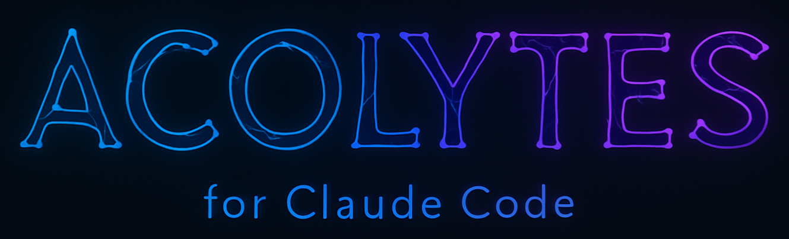

<div align="center">
  
  
  <h3 style="font-size: 1.3em; margin-bottom: 0; text-transform: uppercase;">Revolutionary Multi-Agent System <span style="font-size: 0.65em;">with</span></h3>
  <h1 style="font-size: 2.5em; margin-top: 0; font-weight: bold;">
    ♾️ <span style="color: #568ee2;">NEURAL</span> <span style="color: #6B7FDB;">MEMORY</span> <span style="color: #8B5CF6;">NETWORK</span>
  </h1>
  
  <p align="center" style="font-size: 1.1em; max-width: 800px; margin: 20px auto;">
    Transform Claude Code into an <strong>intelligent project orchestrator</strong> with 59 specialized agents + project-specific Acolytes. Features enterprise-grade <strong>FLAGS coordination system</strong> for seamless cross-agent communication and persistent SQLite memory for cumulative learning.
  </p>
</div>

[](./acolytes/data/resources/rules/agent-routing-catalog.md) [](./acolytes/data/resources/rules/flags-protocol.md)
[](./acolytes/data/scripts/init_db.sql)
[](./acolytes/data/hooks)
[](https://github.com/unmasSk/Acolytes)

## 🧠 What Makes Acolytes for Claude Code REVOLUTIONARY?

### 🚀 BREAKTHROUGH: Enterprise FLAGS Coordination System

**READY**: Acolytes for Claude Code features a sophisticated cross-agent communication protocol that enables seamless coordination between 59 agents. The FLAGS system operates through SQLite database, ensuring no information loss and perfect task handoffs.

#### **FLAGS System Success Stories**

- ✅ **Zero Information Loss**: Perfect context preservation between agent handoffs
- ✅ **Automatic Coordination**: Agents create FLAGS when they detect cross-domain issues
- ✅ **Lock/Unlock Workflows**: Bidirectional communication for complex problem solving
- ✅ **Enterprise Reliability**: Production-tested coordination with audit trails

#### **FLAGS Workflow Example** (Fully Automated)

```
USER> "Add OAuth to my API endpoints"
  ↓
Claude → 📞 @service.auth (OAuth implementation) [AUTO-ROUTED]
  ↓
@service.auth → 🚩 FLAG: "Need users table schema update" [AUTO-DETECTED]
  ↓
Claude → 📞 @database.postgres (schema migration) [AUTO-COORDINATED]
  ↓
@database.postgres → ✅ Adds oauth_provider, refresh_token columns [AUTO-EXECUTED]
  ↓
@service.auth → 🔓 FLAG resolved → ✅ Implements OAuth flow [AUTO-COMPLETED]
  ↓
Claude → 🎯 "OAuth implemented with Google & GitHub providers"
```

**🤖 Everything happens automatically - no manual coordination needed!**

### 🏗️ Advanced Multi-Agent Architecture

#### **[59 Global Agents](./acolytes/data/resources/rules/agent-routing-catalog.md)**

- **Backend**: API, Go, Java, Laravel, Node.js, Python, Rust, Serverless
- **Frontend**: Angular, React, Vue, Mobile
- **Database**: PostgreSQL, MongoDB, Redis, MariaDB, SQLite, pgvector, PostGIS, Vectorial
- **DevOps**: Bash, CI/CD, Containers, Git, IaC, Monitoring, Performance, Troubleshooting, Webserver
- **Business**: Billing, Payments, Subscriptions
- **Services**: AI/ML, Auth, Communication, Data Processing, Integrations, Mapbox
- **Coordinators**: Backend, Frontend, Database, DevOps, Infrastructure, Migration, Security, Testing
- **Analysis**: Data Analysis, Strategic Planning, Compliance, Security Audit
- **Documentation**: Specialist
- **Testing**: Quality Assurance
- **System**: Setup (5 agents), FLAGS, Planning

#### **Acolytes** (Auto-Created per Project)

- One expert agent per detected module (acolyte.auth, acolyte.api, etc.)
- Deep module knowledge stored in 14-memory SQLite system
- Created during `/setup` Phase 6 via `@setup.acolytes-creator`

### 🎯 Intelligent Agent Routing System

**17-rule anti-ambiguity system** eliminates agent selection errors:

- **Strategy vs Implementation**: Coordinators for decisions, specialists for execution
- **RAG/Vector Search**: PostgreSQL+embeddings → `@database.pgvector`, Any vector platform → `@database.vectorial`
- **Auth vs Security**: OAuth/JWT → `@service.auth`, Architecture/compliance → `@coordinator.security`
- **Multi-Agent Workflows**: Sequential, parallel, and coordinated execution patterns


## ⚡ Quick Start

### Installation

#### Option 1: Install from PyPI (Recommended)
````bash
# Install Acolytes package
pip install acolytes

# Initialize Acolytes system (copies all files to ~/.claude)
acolytes init

# Navigate to YOUR project
cd /path/to/your/project

# Open Claude with safety bypass (⚠️ hooks protect against malicious commands)
claude --dangerously-skip-permissions -c

# Inside Claude, run setup
/setup
````

#### Option 2: Install from Source
````bash
# Clone repository
git clone https://github.com/unmasSk/Acolytes.git
cd Acolytes

# Install package
pip install -e .

# Initialize Acolytes system
acolytes init

# Navigate to YOUR project  
cd /path/to/your/project

# Open Claude with safety bypass (⚠️ hooks protect against malicious commands)
claude --dangerously-skip-permissions -c

# Inside Claude, run setup
/setup
````

### Available Commands
| Command       | Description                                           | Agent Integration                 |
| ------------- | ----------------------------------------------------- | --------------------------------- |
| `/setup`      | Integrates Acolytes into your project (new or existing) - 6-phase analysis | 5 setup agents + Acolytes creation |
| `/commit`     | Smart commits with auto-versioning, changelog, and git tagging | `@docs.specialist` + bump2version |
| `/pr`         | Create pull request with comprehensive analysis       | `@ops.git` + review agents       |
| `/flags`      | Process pending FLAGS from agents                     | `@flags.agent` coordinator        |
| `/save`       | Save current session to SQLite database               | Session persistence               |  |

### How Claude Orchestrates

**Claude auto-selects the right agent based on context:**
- USER> "Optimize my API endpoints" → Claude automatically invokes `@backend.python` or `@backend.nodejs`
- USER> "The authentication is broken" → Claude knows to invoke `@service.auth`
- USER> "Add payment processing to my app" → Claude orchestrates `@business.payment` + `@database.postgres` + `@backend.api`

**Or you can explicitly request an agent:**
- USER> "Use @database.postgres to fix the indexing issues" → Claude directs task to specified agent
- USER> "Ask @coordinator.security about compliance requirements" → Claude consults the security coordinator

## 🏗️ Revolutionary Architecture

```
Main Claude Session (Orchestrator)
    │
    ├── 🌍 GLOBAL AGENTS (59) - ~/.claude/agents/
    │   ├── 💻 Backend & Frontend Engineers
    │   ├── 🎛️ Coordinators: Strategic architects for complex decisions
    │   ├── 💾 Database Experts: All major databases + vector stores
    │   ├── ⚙️ DevOps & Operations: CI/CD, monitoring, performance
    │   ├── 💼 Business Systems: Payments, billing, subscriptions
    │   ├── 🔍 Analysis & Audit: Security, compliance, data analysis
    │   └── 🔧 System Agents: Setup, FLAGS coordination, planning
    │
    ├── 🏠 PROJECT ACOLYTES - project/.claude/agents/
    │   ├── acolyte.auth (YOUR authentication module)
    │   ├── acolyte.api (YOUR API endpoints)
    │   └── [Auto-created for each detected module]
    │
    ├── 🚩 FLAGS COORDINATION SYSTEM
    │   ├── Cross-agent communication via SQLite
    │   ├── Lock/unlock workflows for dependencies
    │   ├── Automatic context preservation
    │   └── Zero information loss between handoffs
    │
    └── 🗄️ PERSISTENT MEMORY (SQLite + MCP)
        ├── Session Memory: Jobs system groups Claude sessions
        ├── Agent Memory: 14 types per agent/module
        ├── FLAGS: Pending tasks survive between sessions
        └── Full audit trail of all operations
```

## 🗄️ Persistent Memory System

### SQLite Database (11 Tables)

1. **`agents_catalog`** - Directory of all 59 agents with routing rules
2. **`agent_memory`** - Deep knowledge storage for each agent/module
3. **`acolytes`** - Project-specific agents created during setup
4. **`flags`** - Cross-agent coordination tasks and dependencies
5. **`sessions`** - Conversation history with context preservation
6. **`jobs`** - Groups related work across multiple sessions
7. **`messages`** - Individual message tracking with metadata
8. **`tool_logs`** - Execution history for optimization
9. **`todos`** - Task management synced with Claude
10. **`accomplishments`** - Session achievements and milestones
11. **`error_logs`** - Error tracking for debugging

### 14 Agent Memory Types

- **`knowledge`** - Core understanding: purpose, features, architecture, TODOs
- **`structure`** - Code organization: files, classes, functions, APIs
- **`patterns`** - Best practices: conventions, design patterns, anti-patterns
- **`interfaces`** - Module exports: public APIs, events, contracts
- **`dependencies`** - Connections: internal/external deps, services
- **`schemas`** - Data models: entities, validation, transformations
- **`quality`** - Code health: tests, coverage, security analysis
- **`operations`** - DevOps: deployment, monitoring, CI/CD, migrations
- **`context`** - Business logic: decisions, history, roadmap
- **`domain`** - Specialized: ML models, GraphQL, i18n
- **`security`** - Security profile: permissions, compliance, vulnerabilities
- **`errors`** - Error handling: common failures, recovery procedures
- **`performance`** - Optimization: bottlenecks, caching, scaling
- **`history`** - Recent interactions: consultations, implementations

### MCP Server Integration

**Required MCPs:**
```yaml
mcp-code-index:        # Fast code search and indexing
mcp-server-fetch:      # External API interactions  
sequential-thinking:   # Complex reasoning chains
playwright:            # Browser automation and testing
context7:              # Advanced context management
```

**Optional MCPs:**
```yaml
mcp-server-sqlite:     # Database operations (if needed)
mcp-server-git:        # Git operations (if needed)
n8n-mcp:               # Workflow automation
21st-dev_magic:        # UI/UX enhancements
```

## 🚀 Real-World Usage Examples

### Example 1: Authentication System (Automatic Orchestration)

```
USER> "Implement OAuth authentication with Google and GitHub"
```

Claude automatically orchestrates:
1. `@coordinator.security` → Recommends OAuth2 + JWT hybrid approach
2. `@service.auth` → Implements OAuth flow with passport.js
3. `@database.postgres` → Creates users, sessions, oauth_providers tables
4. `@backend.nodejs` → Integrates middleware and endpoints
5. `@frontend.react` → Builds login components with provider buttons

**Result:** Complete OAuth system in one request, all coordinated via FLAGS

### Example 2: Performance Crisis (FLAGS in Action)

```
USER> "The API is timing out on user searches"
```

Automatic FLAGS workflow:
1. Claude → `@acolyte.api` analyzes endpoints
2. `@acolyte.api` → 🚩 FLAG: "Missing database indexes on search columns"
3. Claude → `@database.postgres` processes FLAG
4. `@database.postgres` → Adds indexes, detects another issue
5. `@database.postgres` → 🚩 FLAG: "Redis cache not configured for search"
6. Claude → `@database.redis` implements caching
7. **Result:** 2.3s → 87ms response time (26x faster)

### Example 3: Complex Migration (Multi-Agent Coordination)

```
USER> "Migrate from MongoDB to PostgreSQL"
```

Coordinated execution:
1. `@coordinator.migration` → Creates migration strategy
2. `@database.mongodb` + `@database.postgres` → Schema mapping
3. FLAGS created for data type mismatches
4. `@backend.nodejs` → Updates all queries and models
5. `@ops.monitoring` → Sets up migration monitoring
6. Rollback plan stored in SQLite for safety

All decisions preserved in Jobs system for future reference

## 🗺️ Roadmap

Coming soon...

## 🌟 Why Acolytes for Claude Code is Revolutionary

### **Enterprise FLAGS Coordination System**

No other system provides seamless cross-agent coordination through a sophisticated FLAGS protocol stored in SQLite. This enables zero information loss during agent handoffs and perfect task continuity.

### **Enterprise-Grade Architecture**

Unlike simple prompt templates, Acolytes for Claude Code is a complete development ecosystem with persistent memory, intelligent routing, and cross-agent coordination that scales with your project complexity.

### **Production-Ready Command System**

With commands like /todo, /flags, /save, and /mcp, Acolytes for Claude Code provides a complete workflow management system that bridges sessions and maintains project continuity.

## 🎯 Acolytes for Claude Code vs Standard Claude Code

| Feature               | Standard Claude Code  | Acolytes for Claude Code                        |
| --------------------- | --------------------- | ----------------------------------------------- |
| **Agents**            | Single AI assistant   | **59 specialized agents + project Acolytes**    |
| **Memory**            | Session-only context  | **Persistent SQLite + cross-session Jobs**      |
| **Coordination**      | Manual task switching | **Automatic FLAGS system with handoffs**        |
| **Agent Selection**   | User must specify     | **Auto-routing based on context**               |
| **Setup**             | Manual configuration  | **Auto-detection + 6-phase analysis**           |
| **Project Learning**  | Starts from zero      | **Builds cumulative module knowledge**          |
| **Error Recovery**    | Manual intervention   | **Auto-FLAGS creation for cross-domain issues** |

## 🐛 Issues & Bug Reports

Found a bug or have an issue? Please report it at:

**[https://github.com/unmasSk/Acolytes/issues](https://github.com/unmasSk/Acolytes/issues)**

Your feedback helps improve Acolytes for everyone!

## 📚 Documentation

### **Core System**

- **[Agent Catalog](./acolytes/data/resources/rules/agent-routing-catalog.md)** - All 59 agents with capabilities
- **[FLAGS Protocol](./acolytes/data/resources/rules/flags-protocol.md)** - Cross-agent coordination system
- **[Agent Routing Rules](./acolytes/data/resources/rules/agent-routing-rules.md)** - 17-rule disambiguation system

### **Commands**

- **[Setup Command](./acolytes/data/commands/setup.md)** - 6-phase project initialization
- **[Commit Command](./acolytes/data/commands/commit.md)** - Smart commits with auto-versioning
- **[PR Command](./acolytes/data/commands/pr.md)** - Pull request automation
- **[FLAGS Command](./acolytes/data/commands/flags.md)** - Process coordination tasks
- **[Save Command](./acolytes/data/commands/save.md)** - Session persistence

### **Templates & Resources**

- **[CLAUDE.md Template](./acolytes/data/resources/templates/claude-template.md)** - Main project configuration
- **[Acolytes Template](./acolytes/data/resources/templates/acolytes-template.md)** - Acolyte agent creation
- **[Architecture Template](./acolytes/data/resources/templates/template-architecture.md)** - System design docs
- **[Infrastructure Template](./acolytes/data/resources/templates/template-infrastructure.md)** - DevOps setup
- **[Roadmap Template](./acolytes/data/resources/templates/template-roadmap.md)** - Project planning
- **[Tech Stack Template](./acolytes/data/resources/templates/template-tech-stack.md)** - Technology choices
- **[Vision Template](./acolytes/data/resources/templates/template-vision.md)** - Project goals & mission

## 🏆 Why Developers Choose Acolytes

### **🎯 Real Impact, Real Numbers**

```
⚡ 26x faster API optimization (2.3s → 87ms)
🔍 50x faster code search with MCP code-index
🎯 Always up-to-date agents with Context7
🧠 14 memory types per module (never forget anything)
🤝 59 specialists working in parallel
♾️ Infinite context through Jobs system
🚩 Zero coordination overhead with FLAGS
```

### **🌟 Game-Changing Innovations**

**You used to:** Write prompts, copy code, lose context, start over  
**Now you:** Give one command, watch 59 agents orchestrate the solution

**You used to:** Manually coordinate between frontend and backend  
**Now:** FLAGS automatically handle cross-domain dependencies

**You used to:** Explain your project every new session  
**Now:** Your project has a living, growing memory

### **💬 What Developers Say**

> *"It's like having a senior dev team that never sleeps, never forgets, and never needs explanations twice."*

> *"FLAGS changed everything. My agents solve problems I didn't even know existed."*

> *"First time I've seen AI actually understand my entire codebase."*

## 📜 License

This project is licensed under the **[MIT License](./LICENSE)** - see the [LICENSE](./LICENSE) file for details.

Free for commercial and personal use.


## ⭐ The Future is Here

```
🎯 One request. 59 specialists. Zero coordination overhead.
```

Imagine typing **"implement authentication"** and watching as:
- 🔐 Security architects design the system
- 🗄️ Database experts create the schema  
- ⚙️ Backend engineers write the logic
- 🎨 Frontend developers build the UI
- 🚩 All coordinating through FLAGS, automatically

**❌ No more context switching.**  
**❌ No more manual handoffs.**  
**❌ No more starting from scratch.**

Every decision, every piece of knowledge, every solution - preserved forever in your project's neural memory. 🧠

This isn't just an upgrade to Claude Code.  
This is the emergence of **autonomous development intelligence**. 🤖

---

<div align="center">
  
### **✨ Your code doesn't just get written.**
### **🎭 It gets orchestrated.**

```bash
pip install acolytes
```

**🚀 Welcome to the revolution.** ♾️

</div>
