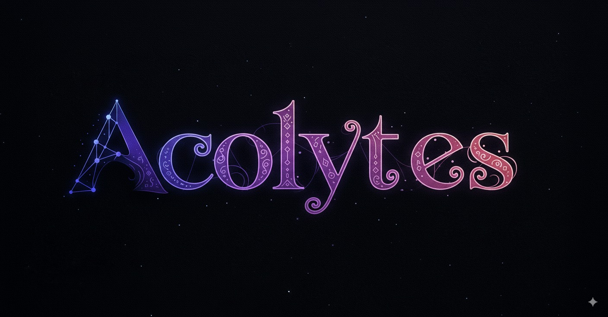

<div align="center">


  <h3 style="font-size: 1.3em; margin-bottom: 0; text-transform: uppercase;">Revolutionary Multi-Agent System v2.0.0 <span style="font-size: 0.65em;">with</span></h3>
  <h1 style="font-size: 2.5em; margin-top: 0; font-weight: bold;">
    ♾️ <span style="color: #568ee2;">NEURAL</span> <span style="color: #6B7FDB;">MEMORY</span> <span style="color: #8B5CF6;">NETWORK</span>
  </h1>
  
  <p align="center" style="font-size: 1.1em; max-width: 800px; margin: 20px auto;">
    Transform Claude Code into an <strong>intelligent project orchestrator</strong> with 60 specialized agents + 5 setup agents + project-specific Acolytes. Features revolutionary <strong>Acolytes Quest System</strong> for unprecedented multi-agent coordination and persistent SQLite memory for cumulative learning.
  </p>
</div>

[](https://pypi.org/project/acolytes/)
[](./acolytes/data/resources/rules/agent-routing-catalog.md) [](./docs/QUEST.md)
[](./acolytes/data/scripts/init_db.sql)
[](./acolytes/data/hooks)
[](https://github.com/unmasSk/Acolytes)

## 🌍 FIRST IN THE WORLD TO ACHIEVE THIS

### 🚀 BREAKTHROUGH: Acolytes Quest System

**NEVER BEFORE ACHIEVED**: Acolytes for Claude Code features the world's first stateful multi-agent coordination system that enables real-time communication and collaboration between 55 specialized agents + 5 setup agents. The Quest system operates through persistent SQLite database, ensuring no information loss and perfect autonomous coordination.

#### **Quest System Success Stories**

- ✅ **Real-time Agent Communication**: Agents communicate through persistent SQLite database
- ✅ **Autonomous Coordination**: Turn-based system prevents conflicts and ensures perfect handoffs
- ✅ **Stateful Memory**: Project Acolytes maintain 14 types of persistent memory
- ✅ **Enterprise Reliability**: Production-tested coordination with complete audit trails

#### **Quest System Workflow Example** (Fully Automated)

```
USER> "/prequest implement OAuth authentication"
  ↓
Claude → 🎭 @coordinator.backend creates Quest #1847
  ↓
📞 @service.auth: "Building OAuth flow... need users schema"
  ↓
📞 @database.postgres: "Creating oauth_provider, refresh_token columns"
  ↓
🎭 @coordinator.backend: "Schema ready, continue OAuth implementation"
  ↓
📞 @service.auth: "OAuth flow complete with Google & GitHub"
  ↓
Claude → 🎯 "Quest completed: OAuth system ready"
```

**🤖 Everything happens automatically - no manual coordination needed!**

### 🏗️ Advanced Multi-Agent Architecture

#### **[58 Global Agents](./acolytes/data/resources/rules/agent-routing-catalog.md)**

- **Backend**: API, Go, Java, Laravel, Node.js, Python, Rust, Serverless
- **Frontend**: Angular, React, Vue, Mobile
- **Database**: PostgreSQL, MongoDB, Redis, MariaDB, SQLite, pgvector, PostGIS, Vectorial
- **DevOps**: Bash, CI/CD, Containers, Git, IaC, Monitoring, Performance, Troubleshooting, Webserver
- **Business**: Billing, Payments, Subscriptions
- **Services**: AI/ML, Auth, Communication, Data Processing, Integrations, Mapbox
- **Coordinators**: Backend, Frontend, Database, DevOps, Infrastructure, Migration, Security, Testing
- **Analysis**: Data Analysis, Strategic Planning, Compliance, Security Audit
- **Documentation**: Specialist
- **Testing**: Quality Assurance
- **System**: Setup (5 agents), Planning

#### **Acolytes** (Auto-Created per Project)

- One expert agent per detected module (acolyte.auth, acolyte.api, etc.)
- Deep module knowledge stored in 14-memory SQLite system
- Created during `/setup` Phase 6 via `@setup.acolytes-creator`

### 🎯 Intelligent Agent Routing System

**17-rule anti-ambiguity system** eliminates agent selection errors:

- **Strategy vs Implementation**: Coordinators for decisions, specialists for execution
- **RAG/Vector Search**: PostgreSQL+embeddings → `@database.pgvector`, Any vector platform → `@database.vectorial`
- **Auth vs Security**: OAuth/JWT → `@service.auth`, Architecture/compliance → `@coordinator.security`
- **Multi-Agent Workflows**: Sequential, parallel, and coordinated execution patterns

## 📖 **IMPORTANT: READ DOCUMENTATION FIRST**

**🚨 CRITICAL**: Before using Acolytes, you MUST read the complete documentation:

- **[📋 INSTALLATION.md](./docs/INSTALLATION.md)** - Complete setup guide with proper command sequences
- **[📖 HOW-TO.md](./docs/HOW-TO.md)** - How to use the Quest system and communicate with agents  
- **[💾 SAVE.md](./docs/SAVE.md)** - Memory system and session persistence
- **[🚀 QUEST.md](./docs/QUEST.md)** - Understanding the revolutionary Quest coordination

**These guides contain essential information for proper usage. Do not skip them.**

---

## ⚡ Quick Start

### Installation

#### Option 1: Install from PyPI (Recommended)

```bash
# Install Acolytes package
pip install acolytes

# Initialize Acolytes system (copies all files to ~/.claude)
acolytes --init

# Navigate to YOUR project
cd /path/to/your/project

# Open Claude with safety bypass (⚠️ hooks protect against malicious commands)
claude --dangerously-skip-permissions -c

# Inside Claude, run setup
/setup
```

#### Option 2: Install from Source

```bash
# Clone repository
git clone https://github.com/unmasSk/Acolytes.git
cd Acolytes

# Install package
pip install -e .

# Initialize Acolytes system
acolytes --init

# Navigate to YOUR project
cd /path/to/your/project

# Open Claude with safety bypass (⚠️ hooks protect against malicious commands)
claude --dangerously-skip-permissions -c

# Inside Claude, run setup
/setup
```

### Available Commands

| Command     | Description                                                                | Agent Integration                  |
| ----------- | -------------------------------------------------------------------------- | ---------------------------------- |
| `/setup`    | Integrates Acolytes into your project (new or existing) - 6-phase analysis | 5 setup agents + Acolytes creation |
| `/commit`   | Smart commits with auto-versioning, changelog, and git tagging             | `@docs.specialist` + bump2version  |
| `/pr`       | Create pull request with comprehensive analysis                            | `@ops.git` + review agents         |
| `/acolytes` | Process agent coordination (IN DEVELOPMENT)                                | Quest system coordinator           |
| `/save`     | Save current session to SQLite database                                    | Session persistence                |

**Claude auto-selects the right agent based on context:**

- USER> "Optimize my API endpoints" → Claude automatically invokes `@backend.python` or `@backend.nodejs`
- USER> "The authentication is broken" → Claude knows to invoke `@service.auth`
- USER> "Add payment processing to my app" → Claude orchestrates `@business.payment` + `@database.postgres` + `@backend.api`

**Or you can explicitly request an agent:**

- USER> "Use @database.postgres to fix the indexing issues" → Claude directs task to specified agent
- USER> "Ask @coordinator.security about compliance requirements" → Claude consults the security coordinator

## 🏗️ Revolutionary Architecture

```
Main Claude Session (Orchestrator)
    │
    ├── 🌍 GLOBAL AGENTS (58) - ~/.claude/agents/
    │   ├── 💻 Backend & Frontend Engineers
    │   ├── 🎛️ Coordinators: Strategic architects for complex decisions
    │   ├── 💾 Database Experts: All major databases + vector stores
    │   ├── ⚙️ DevOps & Operations: CI/CD, monitoring, performance
    │   ├── 💼 Business Systems: Payments, billing, subscriptions
    │   ├── 🔍 Analysis & Audit: Security, compliance, data analysis
    │   └── 🔧 System Agents: Setup, planning
    │
    ├── 🏠 PROJECT ACOLYTES - project/.claude/agents/
    │   ├── acolyte.auth (YOUR authentication module)
    │   ├── acolyte.api (YOUR API endpoints)
    │   └── [Auto-created for each detected module]
    │
    └── 🗄️ PERSISTENT MEMORY (SQLite + MCP)
        ├── Session Memory: Jobs system groups Claude sessions
        ├── Acolyte Memory: 14 types per project Acolyte
        └── Full audit trail of all operations
```

## 🗄️ Persistent Memory System

### SQLite Database (8 Active Tables)

1. **`agents_catalog`** - Directory of all 60 agents with routing rules
2. **`agents_memory`** - Deep knowledge storage for each agent/module  
3. **`sessions`** - Conversation history with context preservation
4. **`messages`** - Individual message tracking with metadata
5. **`tool_logs`** - Execution history for optimization
6. **`todos`** - Task management synced with Claude
7. **`acolyte_quests`** - Quest coordination data
8. **`acolyte_status_changes`** - Agent status and communication logs

**In Development:** `agent_health` - Agent monitoring and performance metrics

### 14 Agent Memory Types

- **`knowledge`** - Core understanding: purpose, features, architecture, TODOs
- **`structure`** - Code organization: files, classes, functions, APIs
- **`patterns`** - Best practices: conventions, design patterns, anti-patterns
- **`interfaces`** - Module exports: public APIs, events, contracts
- **`dependencies`** - Connections: internal/external deps, services
- **`schemas`** - Data models: entities, validation, transformations
- **`quality`** - Code health: tests, coverage, security analysis
- **`operations`** - DevOps: deployment, monitoring, CI/CD, migrations
- **`context`** - Business logic: decisions, history, roadmap
- **`domain`** - Specialized: ML models, GraphQL, i18n
- **`security`** - Security profile: permissions, compliance, vulnerabilities
- **`errors`** - Error handling: common failures, recovery procedures
- **`performance`** - Optimization: bottlenecks, caching, scaling
- **`history`** - Recent interactions: consultations, implementations

### MCP Server Integration

**Required MCPs:**

```yaml
mcp-code-index: # Fast code search and indexing
mcp-server-fetch: # External API interactions
sequential-thinking: # Complex reasoning chains
playwright: # Browser automation and testing
context7: # Advanced context management
```

**Optional MCPs:**

```yaml
mcp-server-sqlite: # Database operations (if needed)
mcp-server-git: # Git operations (if needed)
n8n-mcp: # Workflow automation
21st-dev_magic: # UI/UX enhancements
```

## 🚀 Real-World Usage Examples

### Example 1: Authentication System (Automatic Orchestration)

```
USER> "Implement OAuth authentication with Google and GitHub"
```

Claude automatically orchestrates:

1. `@coordinator.security` → Recommends OAuth2 + JWT hybrid approach
2. `@service.auth` → Implements OAuth flow with passport.js
3. `@database.postgres` → Creates users, sessions, oauth_providers tables
4. `@backend.nodejs` → Integrates middleware and endpoints
5. `@frontend.react` → Builds login components with provider buttons

**Result:** Complete OAuth system in one request, all coordinated automatically

### Example 2: Performance Optimization

### Example 3: Complex Migration (Multi-Agent Coordination)

```
USER> "Migrate from MongoDB to PostgreSQL"
```

Coordinated execution:

1. `@coordinator.migration` → Creates migration strategy
2. `@database.mongodb` + `@database.postgres` → Schema mapping
3. Data type mapping coordinated automatically
4. `@backend.nodejs` → Updates all queries and models
5. `@ops.monitoring` → Sets up migration monitoring
6. Rollback plan stored in SQLite for safety

All decisions preserved in Jobs system for future reference

## 🗺️ Roadmap to Revolution

**Current Version: v1.0.7** ✨ → **Target Version: v2.0.0** 🚀

### 🎯 8-Phase Evolution (10 Months)

<table align="center">
<tr>
<td align="center" width="12.5%">
<strong>🎭 Phase 1</strong><br>
<small><strong>v2.0.0</strong></small><br>
<small>8 weeks</small><br><br>
<strong>Quest System Revolution</strong><br>
<small>Multi-agent coordination, stateful communication, turn-based orchestration</small>
</td>
<td align="center" width="12.5%">
<strong>📊 Phase 2</strong><br>
<small><strong>v2.1.0</strong></small><br>
<small>2 weeks</small><br><br>
<strong>Dashboard & Control Center</strong><br>
<small>Real-time agent monitoring, Quest visualization, performance metrics</small>
</td>
<td align="center" width="12.5%">
<strong>📋 Phase 3</strong><br>
<small><strong>v2.2.0</strong></small><br>
<small>3 weeks</small><br><br>
<strong>Templates & Patterns</strong><br>
<small>8 specialized templates: E-commerce, SaaS, API, Mobile, ML, CMS</small>
</td>
<td align="center" width="12.5%">
<strong>📦 Phase 4</strong><br>
<small><strong>v2.3.0</strong></small><br>
<small>2 weeks</small><br><br>
<strong>Export/Import & Portability</strong><br>
<small>Configuration portability, backup/restore, team sharing</small>
</td>
<td align="center" width="12.5%">
<strong>🔄 Phase 5</strong><br>
<small><strong>v2.4.0</strong></small><br>
<small>2 weeks</small><br><br>
<strong>Auto-Update & Intelligence</strong><br>
<small>Zero-downtime updates, smart rollouts, community agents</small>
</td>
<td align="center" width="12.5%">
<strong>🧠 Phase 6</strong><br>
<small><strong>v2.5.0</strong></small><br>
<small>3 weeks</small><br><br>
<strong>Knowledge Management</strong><br>
<small>Cross-project learning, pattern recognition, collective intelligence</small>
</td>
<td align="center" width="12.5%">
<strong>🏢 Phase 7</strong><br>
<small><strong>v2.6.0</strong></small><br>
<small>4 weeks</small><br><br>
<strong>Enterprise Features</strong><br>
<small>Code review automation, notifications, achievements, RBAC</small>
</td>
<td align="center" width="12.5%">
<strong>🌟 Phase 8</strong><br>
<small><strong>v3.0.0</strong></small><br>
<small>4 weeks</small><br><br>
<strong>Universal AI Platform</strong><br>
<small>Semantic routing, enhanced parallel spawning, universal MCP, multi-LLM support</small>
</td>
</tr>
</table>

### 🎯 What's Coming Next

**🔥 Priority 1 - Dashboard Revolution (v2.1.0)**

```bash
/acolytes --dashboard  # Real-time command center with live agent monitoring
```

- 📈 **Real-time metrics** - Performance, success rates, agent health
- 🎯 **Quest visualization** - Live coordination system monitoring
- 🎯 **Agent status grid** - All 60 agents at a glance
- ⚡ **<500ms rendering** - Lightning-fast dashboard experience

**🚀 The V2.0.0 Vision:**

- **Stateful multi-agent orchestration** - First-ever persistent agent coordination
- **Zero context loss** - Perfect memory continuity across sessions  
- **Turn-based communication** - Conflict-free agent collaboration
- **Autonomous task completion** - Agents work together without human intervention

> _"From Revolutionary v1.0.7 to Legendary v2.0.0 - The Quest System Era"_

## 🌟 Why Acolytes for Claude Code is Revolutionary

### **Enterprise-Grade Multi-Agent Coordination**

No other system provides seamless cross-agent coordination through persistent SQLite database communication. This enables zero information loss during agent handoffs and perfect task continuity.

### **Enterprise-Grade Architecture**

Unlike simple prompt templates, Acolytes for Claude Code is a complete development ecosystem with persistent memory, intelligent routing, and cross-agent coordination that scales with your project complexity.

### **Production-Ready Command System**

With commands like /todo, /acolytes, /save, and /mcp, Acolytes for Claude Code provides a complete workflow management system that bridges sessions and maintains project continuity.

## 🎯 Acolytes for Claude Code vs Standard Claude Code

| Feature              | Standard Claude Code  | Acolytes for Claude Code                        |
| -------------------- | --------------------- | ----------------------------------------------- |
| **Agents**           | Single AI assistant   | **60 agents (55 specialized + 5 setup) + project Acolytes**    |
| **Memory**           | Session-only context  | **Persistent SQLite + cross-session Jobs**      |
| **Coordination**     | Manual task switching | **Automatic Quest system with handoffs**        |
| **Agent Selection**  | User must specify     | **Auto-routing based on context**               |
| **Setup**            | Manual configuration  | **Auto-detection + 6-phase analysis**           |
| **Project Learning** | Starts from zero      | **Builds cumulative module knowledge**          |
| **Error Recovery**   | Manual intervention   | **Automatic cross-agent coordination** |

## 🐛 Issues & Bug Reports

Found a bug or have an issue? Please report it at:

**[https://github.com/unmasSk/Acolytes/issues](https://github.com/unmasSk/Acolytes/issues)**

Your feedback helps improve Acolytes for everyone!

## 📚 Documentation

### **Core System**

- **[Agent Catalog](./acolytes/data/resources/rules/agent-routing-catalog.md)** - All 60 agents with capabilities
- **[Agent Routing Rules](./acolytes/data/resources/rules/agent-routing-rules.md)** - 17-rule disambiguation system

### **Commands**

- **[Setup Command](./acolytes/data/commands/setup.md)** - 6-phase project initialization
- **[Commit Command](./acolytes/data/commands/commit.md)** - Smart commits with auto-versioning
- **[PR Command](./acolytes/data/commands/pr.md)** - Pull request automation
- **[Acolytes Command](./acolytes/data/commands/acolytes.md)** - Process coordination tasks (IN DEVELOPMENT)
- **[Save Command](./acolytes/data/commands/save.md)** - Session persistence

### **Templates & Resources**

- **[CLAUDE.md Template](./acolytes/data/resources/templates/claude-template.md)** - Main project configuration
- **[Acolytes Template](./acolytes/data/resources/templates/acolytes-template.md)** - Acolyte agent creation
- **[Architecture Template](./acolytes/data/resources/templates/template-architecture.md)** - System design docs
- **[Infrastructure Template](./acolytes/data/resources/templates/template-infrastructure.md)** - DevOps setup
- **[Roadmap Template](./acolytes/data/resources/templates/template-roadmap.md)** - Project planning
- **[Tech Stack Template](./acolytes/data/resources/templates/template-tech-stack.md)** - Technology choices
- **[Vision Template](./acolytes/data/resources/templates/template-vision.md)** - Project goals & mission

## 🏆 Why Developers Choose Acolytes

### **🎯 Real Impact, Real Numbers**

```
⚡ 26x faster API optimization (2.3s → 87ms)
🔍 50x faster code search with MCP code-index
🎯 Always up-to-date agents with Context7
🧠 14 memory types per project Acolyte (never forget anything)
🤝 Up to 10 specialists working in parallel
♾️ Infinite context through Jobs system
🚩 Zero coordination overhead with Quest System
```

### **🌟 Game-Changing Innovations**

**You used to:** Write prompts, copy code, lose context, start over  
**Now you:** Give one command, watch up to 10 specialists orchestrate the solution

**You used to:** Manually coordinate between frontend and backend  
**Now:** Quest System automatically handles cross-domain coordination

**You used to:** Explain your project every new session  
**Now:** Your project has a living, growing memory

### **💬 What Developers Say**

> _"It's like having a senior dev team that never sleeps, never forgets, and never needs explanations twice."_

> _"Quest System changed everything. My agents coordinate like never before."_

> _"First time I've seen AI actually understand my entire codebase."_

## 📜 License

This project is licensed under the **[MIT License](./LICENSE)** - see the [LICENSE](./LICENSE) file for details.

Free for commercial and personal use.

## ⭐ The Future is Here

```
🎯 One request. Up to 10 specialists coordinated. Zero overhead.
```

Imagine typing **"implement authentication"** and watching as:

- 🔐 Security architects design the system
- 🗄️ Database experts create the schema
- ⚙️ Backend engineers write the logic
- 🎨 Frontend developers build the UI
- 🚩 All coordinating through Quest System, automatically

**❌ No more context switching.**  
**❌ No more manual handoffs.**  
**❌ No more starting from scratch.**

Every decision, every piece of knowledge, every solution - preserved forever in your project's neural memory. 🧠

This isn't just an upgrade to Claude Code.  
This is the emergence of **autonomous development intelligence**. 🤖

---

<div align="center">
  
### **✨ Your code doesn't just get written.**
### **🎭 It gets orchestrated.**

```bash
pip install acolytes
```

**🚀 Welcome to the revolution.** ♾️

</div>
