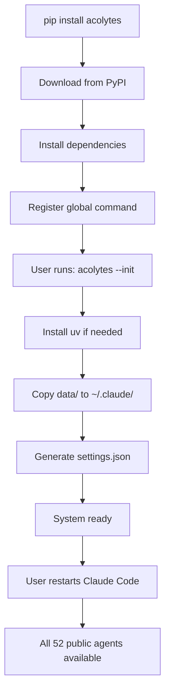

# 📦 ACOLYTES PIP INSTALLATION FLOW - v1.0.0

## 🎯 COMPLETE INSTALLATION PROCESS

### 1️⃣ **PIP INSTALL PHASE**

```bash
pip install acolytes
```

**What happens during installation:**

1. **Package Download** from PyPI (version 1.0.0)
2. **Dependencies Installation**:
   - `click>=8.0` - CLI framework for command-line interface
   - `requests>=2.28` - HTTP library for API calls
   - `colorama>=0.4` - Cross-platform terminal colors
   - `packaging>=21.0` - Version handling utilities

3. **Files Included in Package**:
   ```
   acolytes/
   ├── cli.py                    # Main CLI entry point
   ├── __init__.py              # Package initialization (version 1.0.0)
   ├── commands/                # All CLI commands
   │   ├── init_command.py     # System initialization
   │   ├── update_command.py   # Update to latest version
   │   ├── doctor_command.py   # Diagnose issues
   │   ├── repair_command.py   # Fix configuration
   │   ├── list_command.py     # List agents (52 public only)
   │   ├── backup_command.py   # Backup system
   │   └── clean_command.py    # Clean orphaned files
   └── data/                    # Embedded data files
       ├── agents/              # 59 agent definitions
       │   ├── [52 public].md   # Public agents (backend.*, frontend.*, etc)
       │   └── [7 internal].md  # Internal agents (setup.*, flags.*, plan.*)
       ├── commands/            # Custom Claude commands
       ├── scripts/             # Python utility scripts
       ├── hooks/               # Claude Code hooks
       └── resources/           # Internal templates and resources
   ```

4. **Global Command Registration**:
   ```python
   entry_points={
       "console_scripts": [
           "acolytes=acolytes.cli:main",
       ],
   }
   ```

### 2️⃣ **POST-INSTALL INITIALIZATION**

```bash
acolytes --init
```

**Initialization Flow:**

#### **Step 1: UV Installation Check**
```python
def _install_uv_if_needed():
    # Check if uv exists
    # If not, install based on OS:
    #   Windows: Try winget, then PowerShell
    #   Unix/Mac: curl | sh
```

#### **Step 2: Copy Data Files to ~/.claude/**
```python
def _copy_data_files():
    # Source: package data/
    # Target: ~/.claude/
    
    directories_to_copy = [
        'agents',      # 59 agent files (52 public + 7 internal)
        'commands',    # Custom commands for Claude
        'scripts',     # Python utilities (agent_db.py, etc)
        'hooks',       # 8 Claude Code hooks
        'resources'    # Templates (internal), rules, sfx
    ]
```

**Files Distribution:**
| Directory | Files | Type | Description |
|-----------|-------|------|-------------|
| `~/.claude/agents/` | 52 | Public | Specialized agents for users |
| `~/.claude/agents/` | 7 | Internal | System agents (setup.*, flags.*, plan.*) |
| `~/.claude/commands/` | 5 | Commands | /setup, /save, /pr, /commit, /flags |
| `~/.claude/scripts/` | 12 | Scripts | agent_db.py, save_session.py, etc |
| `~/.claude/hooks/` | 8 | Hooks | session_start, todo_sync, etc |
| `~/.claude/resources/templates/` | 5 | Internal | Project templates |
| `~/.claude/resources/rules/` | 3 | Rules | Agent routing catalog |
| `~/.claude/resources/sfx/` | 3 | Audio | Sound effects |

#### **Step 3: Generate settings.json**
```json
{
  "system": {
    "python_command": "python3",
    "uv_available": true,
    "base_command": "uv run python"
  },
  "hooks": {
    "session_start": { "enabled": true, "file": "session_start.py" },
    "todo_sync": { "enabled": true, "file": "todo_sync.py" },
    "pre_tool_use": { "enabled": true, "file": "pre_tool_use.py" },
    "post_tool_use": { "enabled": true, "file": "post_tool_use.py" },
    "subagent_stop": { "enabled": true, "file": "subagent_stop.py" },
    "user_prompt_submit": { "enabled": true, "file": "user_prompt_submit.py" },
    "stop": { "enabled": true, "file": "stop.py" },
    "pre_compact": { "enabled": true, "file": "pre_compact.py" }
  },
  "database": {
    "path": "~/.claude/memory/project.db",
    "mcp_server": "MCP_SQLite_Server"
  },
  "agents": {
    "total_count": 59,
    "global_agents": 52,    // Public agents shown in list
    "internal_agents": 7,   // Internal agents (hidden)
    "acolytes": "dynamic",
    "catalog_file": "~/.claude/resources/rules/agent-routing-catalog.md"
  },
  "features": {
    "flags_system": true,
    "parallel_execution": true,
    "autonomous_spawning": true,
    "memory_persistence": true,
    "hooks_system": true
  },
  "version": "1.0.0",
  "initialized": true
}
```

#### **Step 4: Final Status Check**
```
📋 Final Status Check:
  ✅ agents/ (59 files)
  ✅ commands/ (5 files)
  ✅ scripts/ (12 files)
  ✅ hooks/ (8 files)
  ✅ resources/ (11 files)
  ✅ settings.json
  ✅ Python: python3
  ✅ uv: available

💡 Next steps:
  1. Restart Claude Code to load new configuration
  2. Run: claude /setup (to initialize project-specific settings)
  3. Use: /todo to manage tasks
  4. Use: @agent-name to invoke specific agents
```

### 3️⃣ **AVAILABLE COMMANDS**

| Command | Description | What it does |
|---------|-------------|--------------|
| `acolytes --init` | **Initialize system** | Install uv, copy files, generate settings |
| `acolytes --update` | **Update to latest** | Pull latest version from PyPI |
| `acolytes --doctor` | **Diagnose issues** | Check system health and configuration |
| `acolytes --repair` | **Repair config** | Fix corrupted or missing files |
| `acolytes --list` | **List agents** | Show 52 public agents (excludes internal) |
| `acolytes --backup` | **Backup system** | Create backup of current installation |
| `acolytes --clean` | **Clean orphans** | Remove unused/orphaned files |
| `acolytes --version` | **Show version** | Display current version (1.0.0) |

### 4️⃣ **AGENT FILTERING**

The `--list` command filters agents:
```python
# Skip internal agents (setup.*, flags.*, plan.*)
internal_prefixes = ('setup.', 'flags.', 'plan.')
if name.startswith(internal_prefixes):
    return None  # Don't show in list
```

**Result**: Only 52 public agents are displayed to users.

### 5️⃣ **VERSION TRACKING**

Version is tracked in multiple places:
- `acolytes/__init__.py`: `__version__ = "1.0.0"`
- `pyproject.toml`: `version = "1.0.0"`
- `setup.py`: `version="1.0.0"`
- `CHANGELOG.md`: Version history with semantic versioning
- `settings.json`: Generated with current version

### 6️⃣ **FILE FLOW SUMMARY**



## ✅ VALIDATION CHECKLIST

- [x] **Package installs correctly** via pip
- [x] **Global command works** after installation
- [x] **UV installation** handled automatically
- [x] **All files copied** to correct locations
- [x] **Settings generated** with proper configuration
- [x] **List shows only 52** public agents (internal hidden)
- [x] **Version 1.0.0** throughout all files
- [x] **All text in English** for international use
- [x] **Commands available** for maintenance
- [x] **Internal templates** marked correctly

## 📝 NOTES

1. **Internal Agents** (7 total):
   - `setup.*` - System setup agents
   - `flags.agent` - FLAG system coordinator
   - `plan.strategy` - Strategic planner
   - These are NOT shown in `--list` command

2. **Internal Resources**:
   - Templates in `resources/templates/` are for system use
   - Not exposed to end users directly
   - Used by agents for project initialization

3. **Automatic Detection**:
   - Python command detected automatically
   - UV availability checked
   - OS-specific installation methods

4. **Cross-Platform**:
   - Windows: PowerShell/winget for uv
   - Mac/Linux: curl for uv
   - Colorama for terminal colors

This flow ensures a smooth, automated installation experience with proper separation of public and internal components.